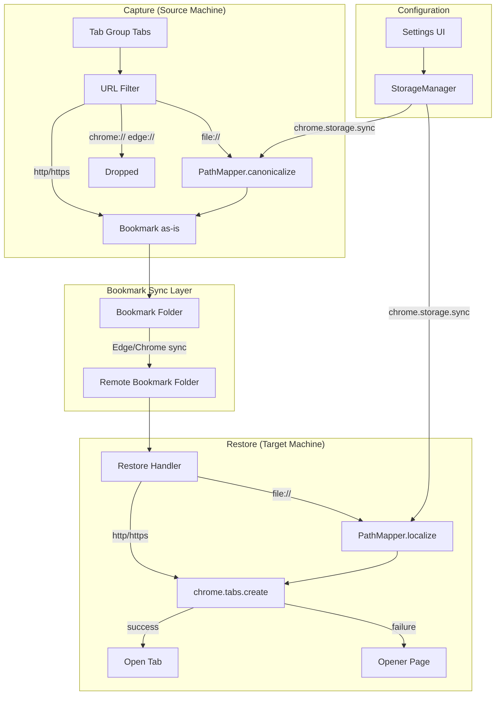
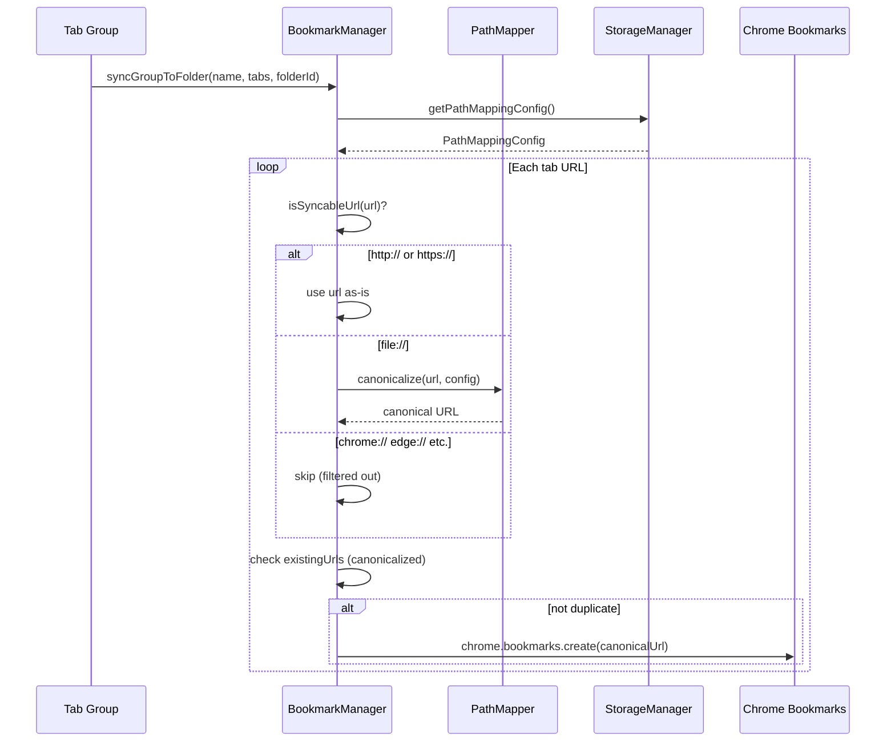
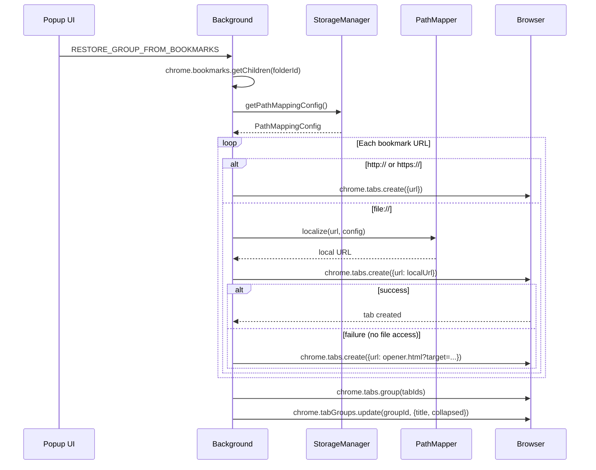

# Design: Local File URL Sync

## Tech Stack

- **Language**: TypeScript (existing)
- **Framework**: React 18 + MUI v6 (existing)
- **Build**: Vite (existing)
- **Testing**: Vitest (unit), fast-check (property), Playwright (E2E)
- **Extension**: Chrome Manifest V3 (existing, no manifest changes)

## Directory Structure

```
src/
├── lib/
│   ├── bookmarks/
│   │   └── bookmarkManager.ts    # MODIFY — URL filter, canonicalization
│   ├── storage/
│   │   └── storageManager.ts     # MODIFY — path mapping persistence
│   ├── sync/
│   │   └── syncEngine.ts         # No changes needed
│   ├── types/
│   │   └── storage.ts            # MODIFY — add PathMapping types
│   └── utils/
│       └── pathMapper.ts         # NEW — bidirectional path mapping logic
├── components/
│   └── Settings.tsx              # MODIFY — add Path Mappings UI section
├── background.ts                 # MODIFY — restore with path mapping
public/
└── opener.html                   # NEW — fallback page for file:// failures
```

## Architecture Overview



## Module Design

### PathMapper (NEW — `src/lib/utils/pathMapper.ts`)

Pure-function utility. No state, no side effects, no Chrome API calls.
Receives mapping config as an argument — doesn't read storage.

- **Purpose**: Bidirectional path prefix rewriting for file:// URLs
- **Interface**:
  ```typescript
  interface PathMappingRule {
    canonicalPrefix: string;   // e.g., "/Users/foo/Dropbox"
    localPrefix: string;       // e.g., "/home/bar/Dropbox"
  }

  interface PathMappingConfig {
    machineId: string;
    rules: PathMappingRule[];
  }

  // Stored in chrome.storage.sync, keyed by machine
  interface PathMappingStore {
    machines: Record<string, PathMappingConfig>;
  }

  // At capture time: local path → canonical path (for bookmarks)
  function canonicalize(fileUrl: string, config: PathMappingConfig): string;

  // At restore time: canonical path → local path (for opening)
  function localize(fileUrl: string, config: PathMappingConfig): string;

  // For deduplication: canonicalize both sides, then compare
  function areSameFile(url1: string, url2: string, config: PathMappingConfig): boolean;

  // Extract filename from file:// URL for bookmark title fallback
  function extractFilename(fileUrl: string): string;

  // Check if a URL is a file:// URL
  function isFileUrl(url: string): boolean;

  // Check if a URL should be synced (http, https, or file)
  function isSyncableUrl(url: string): boolean;
  ```
- **Dependencies**: None (pure functions)

`★ Insight ─────────────────────────────────────`
**Why PathMapper is pure functions, not a class:** The path mapping logic
has no state — it takes a URL and config, returns a rewritten URL. Making
it a class would add lifecycle management, initialization order issues,
and testing complexity for zero benefit. The existing codebase uses the
Manager class pattern for stateful components (StorageManager,
BookmarkManager). PathMapper breaks that pattern deliberately because
mapping is a transformation, not a managed resource.
`─────────────────────────────────────────────────`

### URL Filter Modification (`bookmarkManager.ts`)

The filter at line 369 currently rejects all non-http(s) URLs. The change
is surgical: add `file://` to the allowed schemes and apply canonicalization.

- **Current behavior** (line 363-377):
  ```typescript
  .filter((tab) => {
    // ... type check ...
    if (!tab.url.startsWith('http://') && !tab.url.startsWith('https://')) {
      return false;  // ← THIS LINE DROPS file://
    }
    if (existingUrls.has(tab.url)) {
      return false;
    }
    return true;
  });
  ```

- **New behavior**:
  ```typescript
  .filter((tab) => {
    // ... type check ...
    if (!isSyncableUrl(tab.url)) {
      return false;
    }
    const canonical = isFileUrl(tab.url)
      ? canonicalize(tab.url, mappingConfig)
      : tab.url;
    if (existingUrls.has(canonical)) {
      return false;
    }
    return true;
  });
  ```

  The bookmark is created with the canonicalized URL. The `existingUrls`
  set must also be built from canonicalized URLs for proper deduplication.

- **Dependencies**: `pathMapper.ts` (import `canonicalize`, `isFileUrl`,
  `isSyncableUrl`)

### Restore Handler Modification (`background.ts`)

The restore handler at line 586-639 opens URLs without filtering. The
change adds path mapping before `chrome.tabs.create()` and error handling
for file:// failures.

- **Current behavior** (line 600-613):
  ```typescript
  const urls = bookmarks.filter(b => b.url).map(b => b.url!);
  for (const url of urls) {
    const tab = await chrome.tabs.create({ url, active: false });
    createdTabs.push(tab);
  }
  ```

- **New behavior**:
  ```typescript
  const mappingConfig = await storage.getPathMappingConfig();
  for (const url of urls) {
    const resolvedUrl = isFileUrl(url)
      ? localize(url, mappingConfig)
      : url;
    try {
      const tab = await chrome.tabs.create({ url: resolvedUrl, active: false });
      createdTabs.push(tab);
    } catch (error) {
      if (isFileUrl(resolvedUrl)) {
        // Open the fallback opener page with the target path
        const openerUrl = chrome.runtime.getURL('opener.html')
          + '?target=' + encodeURIComponent(resolvedUrl)
          + '&original=' + encodeURIComponent(url);
        const tab = await chrome.tabs.create({ url: openerUrl, active: false });
        createdTabs.push(tab);
      } else {
        throw error;
      }
    }
  }
  ```

- **Dependencies**: `pathMapper.ts`, `storageManager.ts`

### Storage Schema Extension (`storage.ts`)

Add path mapping types to existing storage types. No changes to existing
fields — pure additions.

```typescript
// NEW types
export interface PathMappingRule {
  canonicalPrefix: string;
  localPrefix: string;
}

export interface PathMappingConfig {
  machineId: string;
  rules: PathMappingRule[];
}

export interface PathMappingStore {
  machines: Record<string, PathMappingConfig>;
}

// EXTEND GlobalSettings
export interface GlobalSettings {
  // ... existing fields unchanged ...
  pathMappings?: PathMappingStore;   // NEW
  currentMachineId?: string;         // NEW
}
```

Storage key: `state:settings` (existing). The `pathMappings` field is
added to the existing settings object. A typical config with 3 machines
and 2 rules each is ~500 bytes — well within the 8KB per-key limit and
100KB total quota for `chrome.storage.sync`.

### StorageManager Extension (`storageManager.ts`)

Add methods for path mapping CRUD. No changes to existing methods.

```typescript
// NEW methods on StorageManager
async getPathMappingConfig(): Promise<PathMappingConfig>;
async setPathMappingConfig(config: PathMappingConfig): Promise<void>;
async getAllMachineConfigs(): Promise<PathMappingStore>;
async getCurrentMachineId(): Promise<string | undefined>;
async setCurrentMachineId(id: string): Promise<void>;
```

`getPathMappingConfig()` returns the config for the current machine
(identified by `currentMachineId`). If no machine ID is set or no
mappings exist, returns an empty config (no rules, no rewriting).

### Settings UI Extension (`Settings.tsx`)

Add a "Path Mappings" section to the existing Settings dialog. Appears
below existing settings, above export/import.

```
┌─────────────────────────────────────────┐
│ Settings                            [X] │
├─────────────────────────────────────────┤
│ Container Folder: [Tab Groups ▼]        │
│ Auto-sync new groups: [toggle]          │
│ ─────────────────────────────────────── │
│ ▸ Path Mappings (file:// sync)          │  ← NEW collapsible section
│   Machine ID: [linux-home    ]          │
│   ┌───────────────────────────────────┐ │
│   │ Canonical         │ This Machine  │ │
│   │ /Users/foo/Dropbox│ /home/b/Dropbx│ │
│   │ [+ Add mapping]                   │ │
│   └───────────────────────────────────┘ │
│   ⚠ Edge Workspace Warning (if Edge)   │  ← Req 7
│ ─────────────────────────────────────── │
│ [Export] [Import]                       │
└─────────────────────────────────────────┘
```

- Collapsible by default (zero visual change for users who don't use it)
- Machine ID is a free-text field, persisted per-machine via
  `chrome.storage.local` (not sync — each machine has its own ID)
- Mapping rules are editable inline (two text fields + delete button)
- Edge Workspace warning appears only when `navigator.userAgent` contains
  "Edg/" (Edge's UA string)

### Opener Page (NEW — `public/opener.html`)

Static HTML page bundled with the extension. No React — plain HTML/CSS/JS
matching `welcome.html` visual style.

- **URL format**: `chrome-extension://EXTID/opener.html?target=FILE_URL&original=CANONICAL_URL`
- **Displays**: Target path, original canonical path (if different),
  "Try opening" button, mapping info, setup instructions
- **"Try opening" button**: Attempts `window.location.href = target` —
  this works if file URL access is enabled
- **Instructions**: How to enable "Allow access to file URLs" with link
  to `chrome://extensions/?id=` + `chrome.runtime.id`
- **Dark mode**: Uses CSS `prefers-color-scheme` media query
- **No dependencies**: Self-contained HTML file, no build step

## Data Flow

### Capture Flow (Tab → Bookmark)



### Restore Flow (Bookmark → Tab)



## State Management

Path mapping config uses existing `chrome.storage.sync` for the mapping
rules (shared across machines) and `chrome.storage.local` for the
machine ID (per-machine).

```
chrome.storage.sync:
  state:settings → {
    ...existing fields...,
    pathMappings: {
      machines: {
        "macbook-work": {
          machineId: "macbook-work",
          rules: [
            { canonicalPrefix: "/Users/foo/Dropbox",
              localPrefix: "/Users/foo/Dropbox" }
          ]
        },
        "linux-home": {
          machineId: "linux-home",
          rules: [
            { canonicalPrefix: "/Users/foo/Dropbox",
              localPrefix: "/home/bar/Dropbox" }
          ]
        }
      }
    }
  }

chrome.storage.local:
  machineId → "linux-home"
```

**Why machine ID is in local, not sync:** Each machine must independently
know its own identity. If it were in sync, all machines would overwrite
each other's ID. The mapping rules (which include all machines) are in
sync so every machine can see every machine's config — needed for the
Settings UI to show all machines.

## Data Models

### PathMappingRule

| Field | Type | Description |
|-------|------|-------------|
| `canonicalPrefix` | `string` | Path prefix as stored in bookmarks |
| `localPrefix` | `string` | Equivalent path on this machine |

### PathMappingConfig

| Field | Type | Description |
|-------|------|-------------|
| `machineId` | `string` | User-assigned label for this machine |
| `rules` | `PathMappingRule[]` | Ordered list of prefix rewrite rules |

## Error Handling Strategy

- **`chrome.tabs.create()` failure for file:// URLs**: Caught per-URL in
  the restore loop. Fallback to opener page. Does NOT abort remaining
  URLs — mixed groups with file:// and http(s):// URLs must not fail as
  a whole.
- **No path mapping configured**: Graceful degradation — URLs pass
  through unchanged. This is the default state for new installs.
- **`chrome.storage.sync` quota exceeded**: Path mapping data is small
  (~500 bytes for typical config). But if the quota is already tight from
  existing sync preferences, the save will fail with the existing quota
  error handling in `StorageManager.saveState()`.
- **File not found at mapped path**: Not detectable by the extension
  (no filesystem access). The browser will show its own error page or
  the file simply won't load. The opener page serves as the explicit
  fallback only when `chrome.tabs.create()` itself throws.

## Testing Strategy

- **Unit tests (Vitest)**: PathMapper pure functions — canonicalize,
  localize, areSameFile, longest-prefix match, edge cases (Windows
  paths, URL-encoded characters, trailing slashes). High coverage,
  fast execution.
- **Property tests (fast-check)**: Round-trip invariant — for any
  file URL and any mapping config,
  `localize(canonicalize(url, config), config) === url`. Prefix
  ordering invariant — longest match always wins. Idempotency —
  canonicalizing an already-canonical URL is a no-op.
- **E2E tests (Playwright)**: Test the full capture→restore flow with
  file:// URLs in a real browser. Requires "Allow access to file URLs"
  enabled in the test browser. Test opener page fallback by NOT enabling
  file access.
- **Test command**: `npm test` (unit + property), `npm run test:e2e`
- **Lint command**: `npx tsc --noEmit`

## Constraints

- **No manifest changes**: No new permissions needed. `file://` access
  is controlled by the per-extension "Allow access to file URLs" toggle,
  not by manifest permissions.
- **No new dependencies**: PathMapper is pure TypeScript. Opener page is
  plain HTML/CSS/JS. Settings UI uses existing MUI components.
- **Backward compatible**: Existing bookmark folders are unchanged.
  File:// URLs only appear in bookmarks after the extension is updated
  AND file:// tabs exist in synced groups.
- **Storage quota**: PathMappingStore must fit within chrome.storage.sync
  limits. With 5 machines × 3 rules × ~60 bytes/rule = ~900 bytes,
  this is well within the 8KB per-key limit.

## Correctness Properties

### Property 1: Round-trip invariant
- **Statement**: *For any* file URL `u` and any PathMappingConfig `c`,
  `localize(canonicalize(u, c), c) === u`
- **Validates**: Req 1.2, Req 3.1
- **Example**: `canonicalize("file:///home/bar/Dropbox/ch1.html", config)`
  → `"file:///Users/foo/Dropbox/ch1.html"` →
  `localize("file:///Users/foo/Dropbox/ch1.html", config)` →
  `"file:///home/bar/Dropbox/ch1.html"`
- **Test approach**: fast-check with arbitrary URL paths and mapping configs

### Property 2: Canonicalization idempotency
- **Statement**: *For any* file URL `u` and config `c`,
  `canonicalize(canonicalize(u, c), c) === canonicalize(u, c)`
- **Validates**: Req 1.4 (dedup requires stable canonical form)
- **Test approach**: fast-check

### Property 3: No duplicate bookmarks
- **Statement**: *For any* sequence of sync operations from different
  machines, a file:// URL for the same logical file produces at most
  one bookmark entry
- **Validates**: Req 1.4
- **Example**: Machine A syncs `/Users/foo/Dropbox/ch1.html`, Machine B
  restores then syncs — the bookmark folder still has exactly one entry
  for that file
- **Test approach**: Unit test simulating multi-machine sync cycles

### Property 4: http(s) URLs unaffected
- **Statement**: *For any* http or https URL, the capture and restore
  paths produce identical behavior to the current (pre-feature) code
- **Validates**: Req 6.5
- **Test approach**: Property test — `canonicalize(httpUrl, anyConfig) === httpUrl`
  and `localize(httpUrl, anyConfig) === httpUrl`

### Property 5: No mapping = no change
- **Statement**: *For any* file URL, when PathMappingConfig has no rules,
  `canonicalize(url, emptyConfig) === url` and
  `localize(url, emptyConfig) === url`
- **Validates**: Req 2.5, NF 1.2
- **Test approach**: fast-check with empty config

## Edge Cases

- **Windows paths**: `file:///C:/Users/foo/...` — the drive letter `C:`
  is part of the path. Mapping rules must handle the leading `/C:` vs
  `C:\` vs `C:/` variations.
- **URL-encoded paths**: `file:///Users/foo/My%20Documents/...` — spaces
  and special characters. PathMapper must compare decoded forms.
- **Trailing slashes**: `/Users/foo/Dropbox` vs `/Users/foo/Dropbox/` —
  both should match the same rule.
- **Overlapping prefixes**: `/Users/foo/Dropbox` and `/Users/foo/Dropbox/Work`
  — longest-prefix match ensures the more specific rule wins.
- **Same canonical and local prefix**: On the "canonical" machine, both
  prefixes are identical. `canonicalize` and `localize` should be no-ops.
- **Fragment and query strings**: `file:///path/file.html#section` —
  the fragment is part of the URL but not the path. Mapping must only
  rewrite the path prefix.

## Decisions

### Decision 1: Bidirectional mapping (not store-as-is)
**Context:** Originally proposed storing file:// URLs as-is in bookmarks.
**Options:**
1. Store as-is — simple but causes flip-flop duplicate bookmarks
2. Bidirectional canonicalization — bookmarks always have canonical form
**Decision:** Bidirectional (option 2)
**Rationale:** The flip-flop problem would create N duplicate bookmarks
for N machines, compounding on every restore-then-sync cycle. Canonical
form ensures `existingUrls.has()` dedup works regardless of which machine
syncs.

### Decision 2: Machine ID in chrome.storage.local
**Context:** Each machine needs to know its own identity for path mapping.
**Options:**
1. chrome.storage.sync — all machines share one value (conflict)
2. chrome.storage.local — per-machine, survives browser restarts
3. Auto-generate from hardware — fragile, not user-meaningful
**Decision:** chrome.storage.local (option 2)
**Rationale:** Machine identity is inherently per-machine. Sync storage
would cause all machines to fight over the same key. Local storage
persists across sessions without sync conflicts.

### Decision 3: Opener page as plain HTML (not React)
**Context:** The opener page needs to be self-contained.
**Options:**
1. React component in the popup — can't open as a standalone page
2. Plain HTML page — no build dependencies, fast load, matches welcome.html
**Decision:** Plain HTML (option 2)
**Rationale:** Opener page loads in a regular tab, not the popup context.
It needs to work independently of the React app. welcome.html already
proves this pattern. Adding it to the Vite build would require new entry
point config for minimal benefit.

### Decision 4: No manifest permission changes
**Context:** file:// access could theoretically be declared in manifest.
**Options:**
1. Add `"file://*"` to manifest permissions — might trigger scary
   permission prompts on update
2. No manifest change — rely on per-extension "Allow access to file URLs"
**Decision:** No manifest change (option 2)
**Rationale:** The `file://` scheme cannot be declared in Manifest V3
`permissions` or `host_permissions`. Access is controlled solely by the
browser's per-extension toggle. This is a Chromium security boundary we
cannot override. `chrome.extension.isAllowedFileSchemeAccess()` lets us
detect the state and guide the user.

## Security Considerations

- **Path traversal**: PathMapper rewrites prefixes only — it does not
  construct arbitrary paths. A mapping from `/Users/foo/Dropbox` to
  `/home/bar/Dropbox` only applies to URLs whose path starts with the
  canonical prefix. No risk of writing outside the mapped directory.
- **URL injection**: The opener page receives URLs via query parameters.
  These must be sanitized before rendering in the DOM (use `textContent`,
  not `innerHTML`). The "Try opening" button uses `window.location.href`
  which is safe for `file://` URLs.
- **XSS in opener page**: The opener page displays user-provided paths.
  All dynamic content must use text nodes, never `innerHTML`. The page
  has no external script imports.
- **Bookmark content**: Canonical file:// URLs in bookmarks are visible
  to anyone with access to the browser profile. This is the same
  exposure level as existing http(s) bookmarks — no new risk.
