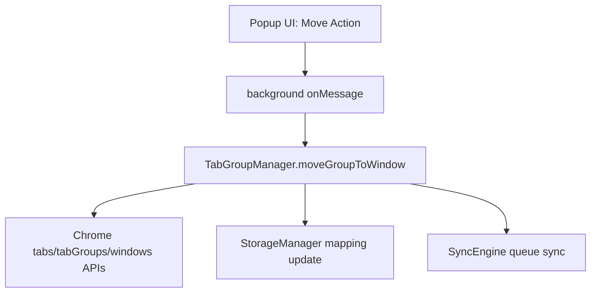
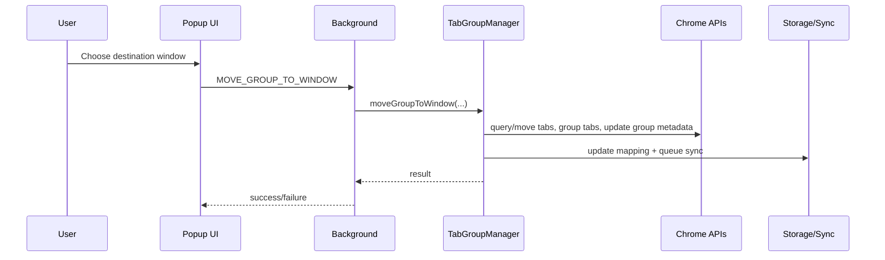

# Design: move-group-across-windows

## Tech Stack
- **Language**: TypeScript
- **Framework**: React 18 + Chrome Extension MV3
- **Testing**: Vitest + Playwright
- **APIs**: `chrome.windows`, `chrome.tabs`, `chrome.tabGroups`, `chrome.tabGroups.query`, `chrome.storage`

## Directory Structure

```text
src/
  components/
    GroupSection.tsx              # add move action UI
    MoveGroupDialog.tsx           # new destination picker dialog
  lib/
    tabGroupManager.ts            # move orchestration entry
    sync/syncEngine.ts            # mapping consistency hooks
    storage/storageManager.ts     # bounded history/retention helpers
    utils/windowLabelBuilder.ts   # human-friendly window label construction
  background.ts                   # message route for move command

tests/
  unit/
    tabGroupManager.move.test.ts
    storage/retention-policy.test.ts
  e2e/
    move-group-across-windows.test.ts
```

## Architecture Overview



## Module Design

### MoveGroupDialog (new)
- **Purpose**: Let user pick a destination window for a selected group.
- **Inputs**: source group name/id
- **Outputs**: target window id submission
- **States**: loading windows, ready, submitting, error
- **Window labeling**: Uses `windowLabelBuilder` to show human-friendly labels:
  - Primary: tab group names in the window (comma-separated)
  - Fallback: active tab title/domain if no groups
  - Last resort: "Window — N tabs"
  - Focused window gets a visual indicator
- **Data fetching**: `chrome.windows.getAll({ populate: true })` + `chrome.tabGroups.query({})` to build labels in one pass

### windowLabelBuilder (new utility)
- **Purpose**: Build a human-readable label for a browser window.
- **Interface**:
  ```ts
  interface WindowLabel {
    windowId: number;
    label: string;        // e.g. "Work, Research" or "github.com"
    tabCount: number;
    isFocused: boolean;
  }

  function buildWindowLabels(
    windows: chrome.windows.Window[],
    tabGroups: chrome.tabGroups.TabGroup[]
  ): WindowLabel[];
  ```
- **Dependencies**: None (pure function over Chrome API data)
- **Logic**:
  1. For each window, collect tab group names from `tabGroups` matching `windowId`
  2. If groups exist → join names with ", "
  3. Else find the active tab → use its title (truncated) or extract domain from URL
  4. Else → "Window — N tabs"
  5. Attach `isFocused` from `window.focused`

### TabGroupManager.moveGroupToWindow (new)
- **Purpose**: Orchestrate group move across windows and preserve logical group identity.
- **Signature (proposed)**:
  ```ts
  moveGroupToWindow(params: {
    sourceGroupId: number;
    sourceGroupName: string;
    targetWindowId: number;
  }): Promise<{ targetGroupId: number; movedTabCount: number }>;
  ```
- **Steps**:
  1. Read tabs in source group
  2. Move tabs to target window
  3. Recreate group in target window
  4. Apply original title/color
  5. Update mapping with new `currentGroupId`
  6. Queue sync

### Background message route (extension service worker)
- **Purpose**: Accept UI move command and call manager method safely.
- **Command (proposed)**: `MOVE_GROUP_TO_WINDOW`
- **Validation**: verify group exists and target window is eligible.

### Storage retention policy additions
- **Purpose**: enforce bounded persistence.
- **Policy**:
  - Persist latest status only per mapping
  - History ring buffer (default 200 entries)
  - Optional age pruning (default 7 days)

## Data Flow



## State Management

### Persistent (required)
- Group logical mapping (name, folderId, currentGroupId, syncEnabled)
- Global settings
- Latest sync status per group

### Transient (non-persistent)
- Retry counters
- In-flight move operation flags
- Detailed per-step debug event timeline

## Error Handling Strategy
- On partial move failure:
  - return structured error to UI
  - keep mapping recoverable (do not delete mapping)
  - trigger resync to reconcile state
- On target window invalid/closed:
  - abort safely with actionable error

## Testing Strategy
- **Unit tests**:
  - move orchestration success/failure branches
  - retention pruning behavior
- **E2E tests**:
  - move group between windows and verify sync continuity
  - prevent duplicate move submissions
  - move under rapid event churn
- **Commands**:
  - `npm test`
  - `npx playwright test --config tests/e2e/playwright.config.ts -g "move group"`

## Constraints
- Must operate with standard Chrome/Edge extension APIs (no Edge-only workspace API dependency)
- Keep existing sync behavior compatible
- Avoid introducing duplicate folder creation regressions

## Correctness Properties

### Property 1: Logical Identity Preservation
- **Statement**: For any successful move, the logical group mapping remains the same entity and only runtime group ID changes.
- **Validates**: Requirement 1.4, 2.1

### Property 2: No Duplicate Folder Side Effects
- **Statement**: For any move followed by sync, at most one active destination folder mapping exists for the logical group.
- **Validates**: Requirement 2.2, NF 1.1

### Property 3: Bounded Persistence
- **Statement**: For any long-running workload, persisted history remains within configured caps.
- **Validates**: Requirement 3.3, 3.4

### Property 4: Human-Friendly Window Labels
- **Statement**: For any set of eligible windows, the label builder produces a non-empty, recognizable label for every window — using group names when present, active tab info as fallback, and a generic tab count as last resort.
- **Validates**: Requirement 5.1, 5.2, 5.3, 5.4
- **Example**: A window with groups "Work" and "Research" produces label "Work, Research"; a window with only ungrouped tabs showing github.com produces "github.com"
- **Test approach**: Unit test with mocked window/tabGroup data covering all three label tiers and focused state

## Edge Cases
- Target window closes during move
- Source group changes while operation in progress
- Some tabs fail to move due to browser constraints
- Group renamed immediately after move
- Window has many tab groups — label may be very long (truncate or cap displayed group count)
- All tabs in window are in incognito or restricted — active tab title may be empty
- Window has tab groups but all groups are collapsed — groups still queryable via API

## Decisions
- Use single-group move first, not bulk operations
- Keep retry/details transient by default
- Implement bounded history retention to reduce sync storage pressure

## Security Considerations
- Do not log sensitive tab data beyond URL/title already handled by existing sync policy
- Validate message payloads to prevent malformed move requests
