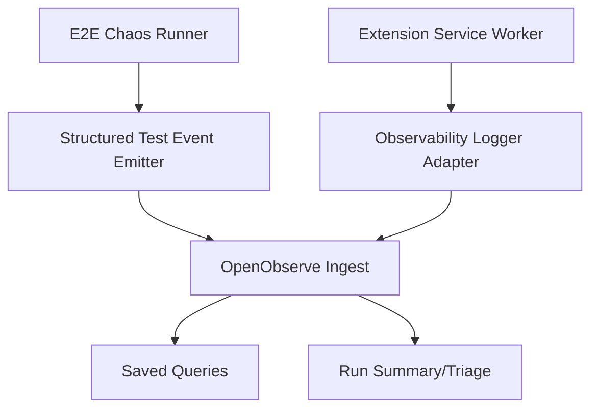
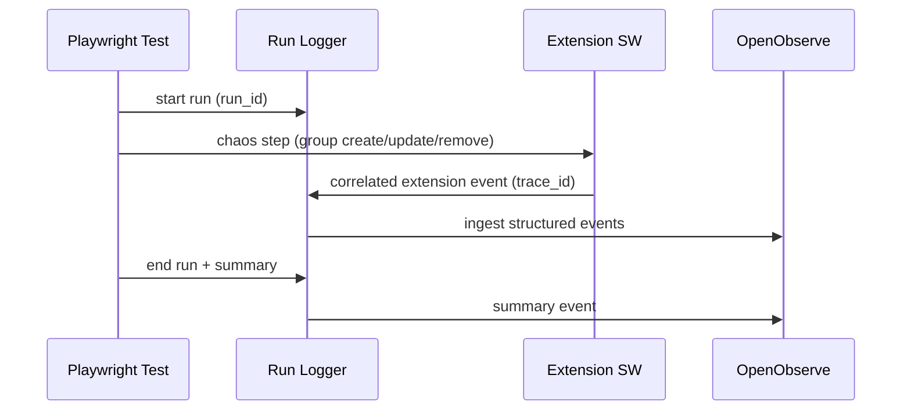

# Design: observability-openobserve

## Tech Stack
- **Language**: TypeScript
- **Framework**: Chrome Extension MV3 + Playwright
- **Observability Backend**: OpenObserve (self-hosted container)
- **Telemetry Format**: OTel-compatible structured events (JSON)
- **Testing**: Vitest + Playwright

## Directory Structure

```text
.kiro/specs/observability-openobserve/
  requirements.md
  design.md
  tasks.md
  progress.txt

devtools/observability/
  docker-compose.openobserve.yml
  queries/
  dashboards/

tests/e2e/
  chaos-reliability.test.ts
  observability/
    runLogger.ts
    schema.ts
```

## Architecture Overview



## Module Design

### `tests/e2e/observability/schema.ts`
- **Purpose**: Define versioned event schema and required fields
- **Interface**:
  - `type ObservabilityEventV1`
  - `validateEvent(event): ValidationResult`
- **Dependencies**: none (pure TS)

### `tests/e2e/observability/runLogger.ts`
- **Purpose**: Emit structured events from Playwright tests and write per-run artifacts
- **Interface**:
  - `createRunContext(scenario): RunContext`
  - `logStep(runContext, event)`
  - `flushRunArtifacts(runContext)`
- **Dependencies**: Node fs/path, Playwright testInfo

### `src/lib/utils/logger.ts` integration
- **Purpose**: Add optional observability adapter path for structured reliability events
- **Interface**:
  - `logger.event(type, payload, options?)`
- **Dependencies**: existing logger + config flag

### `devtools/observability/docker-compose.openobserve.yml`
- **Purpose**: Start local OpenObserve service
- **Dependencies**: Docker

## Data Flow



## State Management
- `run_id` generated per test run
- `trace_id` generated per scenario/operation chain
- Run-local buffers in test harness, flushed at test end

## Data Models

### ObservabilityEventV1
- `schema_version: "v1"`
- `timestamp: number`
- `run_id: string`
- `trace_id: string`
- `scenario: string`
- `event_type: string`
- `status: "ok" | "warn" | "error"`
- `attributes: Record<string, unknown>`
- Optional error block:
  - `error_name`
  - `error_message`
  - `error_code`

## Error Handling Strategy
- Event emission failures must be non-fatal for extension behavior and tests
- Ingestion/network failures should fallback to local artifact buffering
- Schema validation failures should fail chaos test in strict mode

## Testing Strategy
- **Unit tests**: schema validation and run logger behavior
- **Property tests**: event schema invariants under random payload generation
- **E2E tests**: chaos scenario with run_id correlation and summary output
- **Test command**: `npm test` and `npx playwright test --config tests/e2e/playwright.config.ts -g chaos`

## Constraints
- Preserve current extension behavior when observability is disabled
- Avoid high-cardinality unbounded fields in default event payloads
- Keep instrumentation additions focused on reliability paths

## Correctness Properties

### Property 1: Correlation Completeness
- **Statement**: For any chaos run, every emitted extension reliability event includes `run_id` and `trace_id` when correlation context is available
- **Validates**: Requirement 2.1, 4.2
- **Test approach**: E2E run artifact assertions

### Property 2: Non-Interference
- **Statement**: For any instrumentation failure, core sync operations continue and do not throw due to observability path
- **Validates**: Requirement 3.2, 3.3
- **Test approach**: fault-injection unit tests around logger adapter

### Property 3: Queryability Without Custom Parsing
- **Statement**: For any failed run, baseline saved queries identify top anomalies without ad-hoc parser code
- **Validates**: Requirement 5.1, 5.2
- **Test approach**: documented query playbook + fixture dataset checks

## Edge Cases
- Extension events before run context is attached
- Duplicate folders and delayed sync completion under high churn
- Browser URL redirects causing expected/actual URL divergence
- Ingestion service temporarily unavailable

## Decisions
- Prefer OTel-compatible JSON schema first, full tracing SDK optional later
- Start with log/event ingestion before adding span-heavy instrumentation
- Keep local-first workflow as the default

## Security Considerations
- Avoid logging auth tokens/cookies
- Keep local OpenObserve not publicly exposed by default
- Provide data retention guidance in docs
