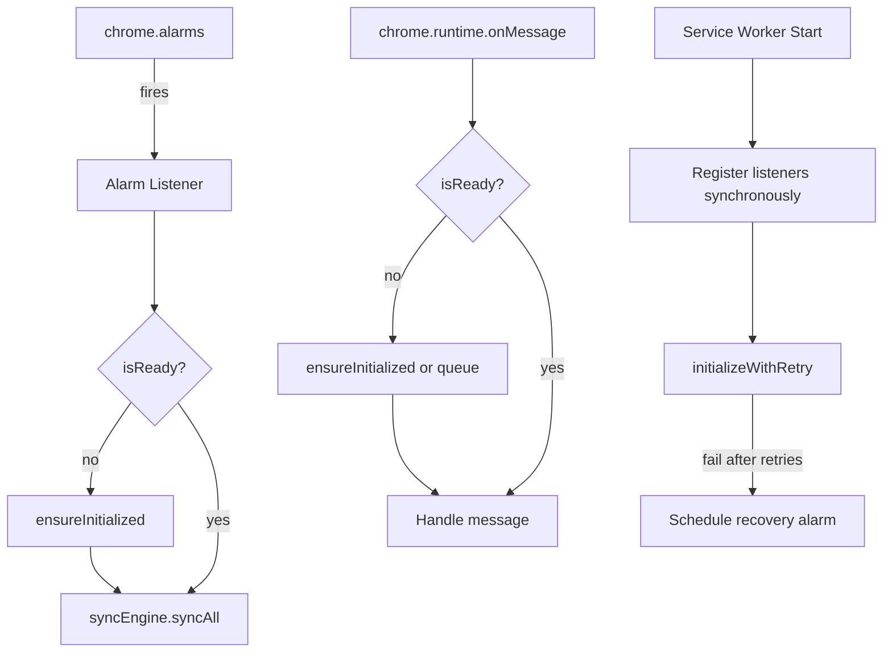
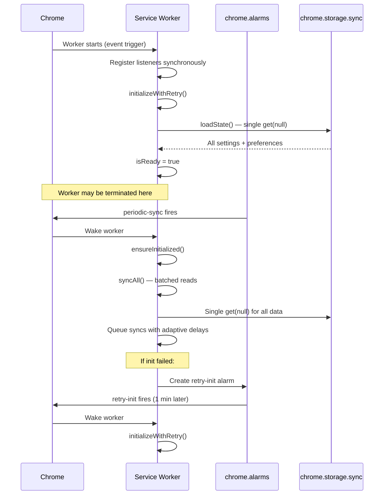

# Design: sw-reliability

## Tech Stack

- **Language**: TypeScript
- **Runtime**: Chrome MV3 Service Worker
- **APIs**: `chrome.alarms`, `chrome.storage.sync`, `chrome.bookmarks`, `chrome.runtime`
- **Testing**: Vitest (unit/property), Playwright (E2E), fast-check (property-based)
- **Test command**: `npm test` (unit/property), `npm run test:e2e` (E2E)

## Architecture Overview



## Module Changes

### 1. background.ts — Alarm-Based Periodic Sync

**Current problem**: `setInterval` is lost when the service worker terminates.

**Solution**: Replace `setInterval` with `chrome.alarms.create`. The alarm fires even if the worker was terminated — Chrome wakes the worker to deliver the event.

```
// Remove startPeriodicSync's setInterval
// Replace with:
chrome.alarms.create('periodic-sync', { periodInMinutes: 5 });

chrome.alarms.onAlarm.addListener(async (alarm) => {
  if (alarm.name === 'periodic-sync') {
    await ensureInitialized();
    await syncEngine.syncAll();
  }
  if (alarm.name === 'retry-init') {
    await initializeWithRetry();
  }
});
```

**Key change**: `ensureInitialized()` is a new function that checks `isReady` and re-initializes if needed. This is the single entry point for all wake-up paths.

### 2. background.ts — ensureInitialized Guard

**Current problem**: If `isReady` is false, every message returns an error forever.

**Solution**: A lazy-init guard that any code path can call.

```
async function ensureInitialized(): Promise<boolean> {
  if (isReady) return true;
  try {
    await initializeManagers();
    isReady = true;
    return true;
  } catch (error) {
    logger.error('ensureInitialized:failed', { error });
    return false;
  }
}
```

Message handlers call `ensureInitialized()` instead of checking `isReady` and returning an error. If it fails, *then* return the error.

### 3. background.ts — Message Queuing During Init

**Current problem**: Messages arriving during initialization get error responses.

**Solution**: Queue messages while initialization is in progress, process them after.

```
let initPromise: Promise<void> | null = null;
const pendingMessages: Array<{ message, sender, sendResponse }> = [];

// In onMessage listener:
if (!isReady) {
  if (!initPromise) {
    initPromise = ensureInitialized().then(() => { initPromise = null; });
  }
  // Queue the message and process after init
  await initPromise;
  if (!isReady) {
    sendResponse({ error: 'Extension failed to initialize' });
    return;
  }
  // Fall through to normal handling
}
```

### 4. storageManager.ts — Resilient Container Folder Check

**Current problem**: `performMaintenance` calls `chrome.bookmarks.get(containerFolderId)` once. If it fails for any reason, it wipes `containerFolderId` permanently.

**Solution**: Retry with backoff, and distinguish "folder genuinely deleted" from "transient API failure".

```
private async verifyContainerFolder(): Promise<'exists' | 'deleted' | 'unverified'> {
  const id = this.persistedState.settings.containerFolderId;
  if (!id) return 'deleted';

  for (let attempt = 1; attempt <= 3; attempt++) {
    try {
      const folder = await chrome.bookmarks.get(id);
      if (folder && folder.length > 0) return 'exists';
      return 'deleted';  // API succeeded but folder not found = genuinely deleted
    } catch (error) {
      if (attempt < 3) {
        await new Promise(r => setTimeout(r, 500 * attempt));
        continue;
      }
      // All retries failed — don't wipe config
      this.logger.warn('maintenance:containerFolderUnverified', {
        id, attempts: 3, error
      });
      return 'unverified';
    }
  }
  return 'unverified';
}
```

In `performMaintenance`:
- `'exists'` → continue normally
- `'deleted'` → clear `containerFolderId`, show error (current behavior, but only on confirmed deletion)
- `'unverified'` → log warning, keep `containerFolderId`, skip folder-dependent maintenance

### 5. storageManager.ts — Batched Bookmark Lookups

**Current problem**: `initializeRuntimeMappings` calls `chrome.bookmarks.getChildren(containerFolder.id)` once (good), but then for each group it does individual lookups.

**Solution**: Load all children once, build a lookup map.

```
private async initializeRuntimeMappings(): Promise<void> {
  const containerFolder = await this.getTabGroupsFolder();
  if (!containerFolder) { /* existing error handling */ return; }

  // Single API call — build lookup map
  const children = await chrome.bookmarks.getChildren(containerFolder.id);
  const folderByName = new Map(children.map(f => [f.title, f]));

  for (const [name, pref] of Object.entries(this.persistedState.syncPreferences)) {
    const folder = folderByName.get(name);
    this.runtimeState.mappings[name] = {
      name,
      folderId: folder?.id || '',
      syncEnabled: pref.syncEnabled,
      status: { lastSynced: pref.lastSynced ?? 0, inProgress: false }
    };
  }
}
```

### 6. syncEngine.ts — Batched Settings Load in syncAll

**Current problem**: `syncAll` calls `storage.getMapping(name)` and `storage.getGroupSyncSettings(name)` for each group — N*2 storage reads.

**Solution**: Load all data in one call at the start of `syncAll`.

```
async syncAll(): Promise<void> {
  const settings = await this.storage.getSettings();
  if (!settings.containerFolderId) return;

  // Single load of all mappings and preferences
  const allMappings = await this.storage.getAllMappings();
  const allPreferences = await this.storage.getAllSyncPreferences();

  // ... use allMappings and allPreferences instead of per-group calls
}
```

This requires adding `getAllSyncPreferences()` to StorageManager (trivial — it already has the data in `persistedState.syncPreferences`).

### 7. syncEngine.ts — Skip History Writes for No-Change Syncs

**Current problem**: `syncGroupToFolder` writes a history entry even when the hash check shows no changes.

**Solution**: Remove the history write from the no-change path. Only write history on actual syncs, errors, and user actions.

### 8. background.ts — Unhandled Rejection Listener

```
self.addEventListener('unhandledrejection', (event) => {
  logger.error('unhandledRejection', {
    reason: event.reason?.message || String(event.reason),
    stack: event.reason?.stack
  });
  // Don't let it crash silently — attempt recovery
  if (!isReady) {
    chrome.alarms.create('retry-init', { delayInMinutes: 1 });
  }
});
```

### 9. manifest.json — Add Alarms Permission

```json
"permissions": ["tabs", "tabGroups", "bookmarks", "storage", "unlimitedStorage", "alarms"]
```

## Data Flow



## Error Handling Strategy

| Scenario | Current Behavior | New Behavior |
|----------|-----------------|-------------|
| Worker terminated | `setInterval` lost, sync stops | `chrome.alarms` persists, sync resumes |
| Init fails 3x | `isReady = false` forever | Schedule `retry-init` alarm, retry every 60s |
| Message while `!isReady` | Return error immediately | Call `ensureInitialized()`, queue if in progress |
| Container folder check fails | Wipe `containerFolderId` | Retry 3x, keep config if unverified |
| Unhandled rejection | Silent crash | Log + schedule recovery alarm |
| `syncAll` with 20 groups | 40+ storage reads | 1 batched read |
| No-change sync | Write history entry | Skip history write |

## Testing Strategy

- **Property tests**: Verify resilience properties (retry logic, state preservation, batching)
- **E2E tests**: Validate alarm-based sync, recovery from worker termination, config persistence
- **Test command**: `npm test` (unit/property), `npm run test:e2e` (E2E)

## Correctness Properties

### Property 1: Alarm Persistence

- **Statement**: *For any* service worker lifecycle (start → idle → terminate → wake), the periodic sync alarm SHALL exist and fire at the configured interval
- **Validates**: Requirement 1.1, 1.2, 1.5
- **Example**: Worker starts, creates alarm, goes idle, Chrome terminates it, alarm fires, worker wakes, sync runs
- **Test approach**: Mock `chrome.alarms` API, verify alarm is created on init and listener handles wake-up correctly

### Property 2: Configuration Survival

- **Statement**: *For any* sequence of transient bookmark API failures during `performMaintenance`, the `containerFolderId` SHALL NOT be cleared unless the folder is confirmed deleted (API returns empty result, not an error)
- **Validates**: Requirement 2.1, 2.2, 2.4
- **Example**: `chrome.bookmarks.get` throws 3 times → `containerFolderId` preserved. `chrome.bookmarks.get` returns `[]` → `containerFolderId` cleared.
- **Test approach**: Property test with randomized failure sequences — verify config preserved on errors, cleared only on confirmed deletion

### Property 3: Self-Recovery Convergence

- **Statement**: *For any* initialization failure, the system SHALL eventually reach `isReady = true` if the underlying cause resolves, within a bounded number of retry attempts
- **Validates**: Requirement 3.1, 3.2, 3.5
- **Example**: Init fails 3x (max retries), recovery alarm fires, init succeeds on 4th attempt → `isReady = true`
- **Test approach**: Mock init to fail N times then succeed, verify recovery alarm is created and eventually succeeds

### Property 4: Message Delivery Guarantee

- **Statement**: *For any* message arriving while `isReady = false`, the message SHALL either be processed after successful initialization or receive a meaningful error after initialization failure — never silently dropped
- **Validates**: Requirement 3.2, 5.2
- **Example**: Popup sends GET_SETTINGS while worker is initializing → message queued → init completes → settings returned
- **Test approach**: Send messages during simulated init delay, verify all get responses

### Property 5: Bulk Sync Efficiency

- **Statement**: *For any* N synced groups, `syncAll` SHALL make O(1) storage read calls (not O(N))
- **Validates**: Requirement 4.1, 5.3
- **Example**: 20 groups → 1 `chrome.storage.sync.get(null)` call, not 40+ individual calls
- **Test approach**: Mock storage API, count calls during `syncAll` with varying group counts

### Property 6: No-Change Sync Idempotency

- **Statement**: *For any* sync operation where the tab hash is unchanged, the system SHALL NOT write to `chrome.storage.sync`
- **Validates**: Requirement 4.2
- **Example**: Sync group "Work" twice with same tabs → second sync does zero storage writes
- **Test approach**: Track storage write calls, verify zero writes on unchanged sync

### Property 7: Backward Compatibility

- **Statement**: *For any* existing user with settings stored in the current format, upgrading to the new version SHALL preserve all `containerFolderId`, sync preferences, and mappings
- **Validates**: NF 1.1
- **Example**: User has 10 synced groups → upgrade → all 10 groups still synced with same folders
- **Test approach**: Seed storage with current-format data, run new initialization, verify all data preserved

## Edge Cases

1. **Alarm fires during initialization**: `ensureInitialized` must be reentrant — if init is already in progress, await the existing promise rather than starting a second init
2. **Multiple rapid wake-ups**: Alarm + message arrive simultaneously — must not double-initialize
3. **Storage quota during recovery**: If storage is full during re-init, don't make it worse by writing error state
4. **Container folder recreated with different ID**: User deletes and recreates the folder — the old ID is invalid but a folder with the same name exists at a different ID

## Decisions

1. **`chrome.alarms` over `setInterval`**: Alarms are the only MV3-compatible way to schedule persistent work. Minimum interval is 1 minute (Chrome enforces this).
2. **Lazy init over eager init**: `ensureInitialized()` is called on-demand rather than relying solely on startup init. This handles all wake-up paths uniformly.
3. **Retry with backoff for folder verification**: 3 retries with 500ms/1s/1.5s delays balances reliability with startup speed.
4. **Message queuing over message rejection**: Better UX — the popup waits briefly rather than showing an error.
5. **Batched storage reads**: One `get(null)` is faster and more quota-friendly than N individual `get()` calls.
