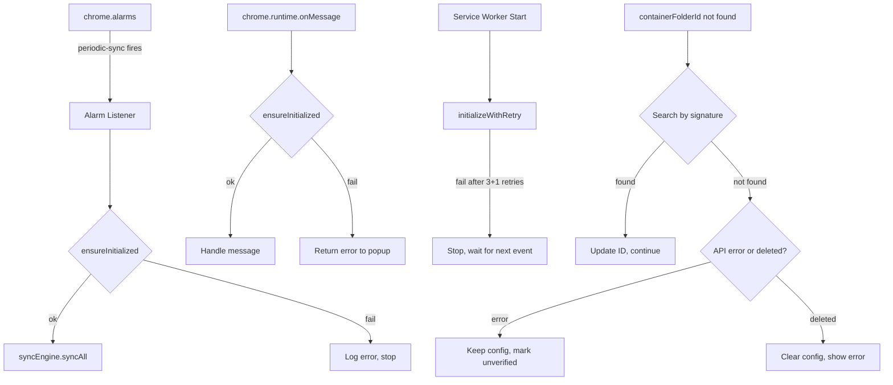
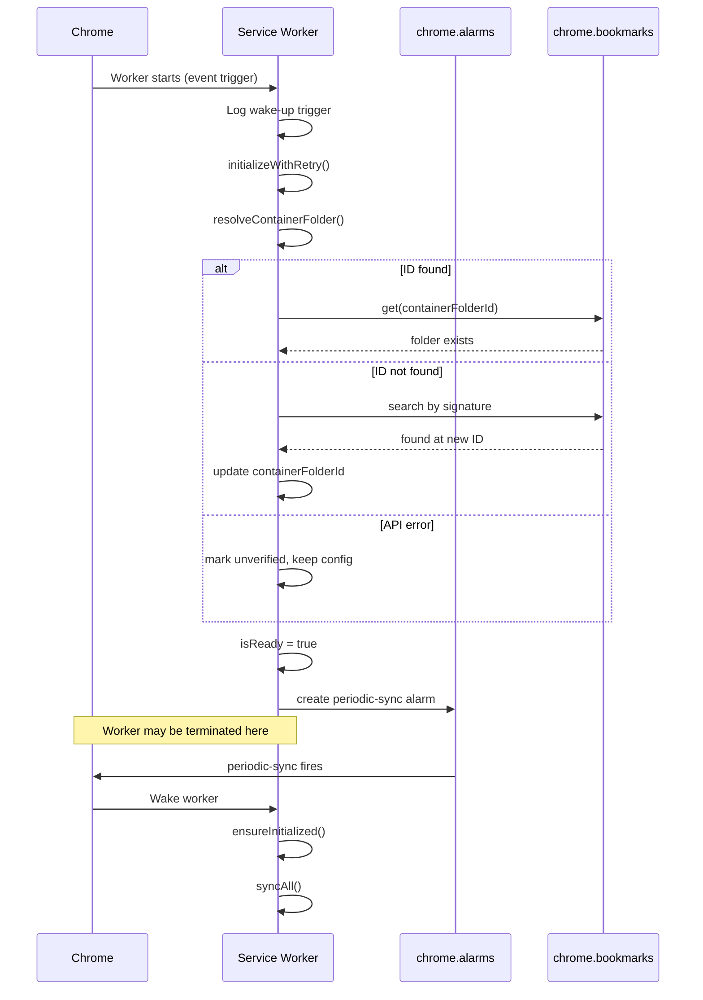

# Design: sw-reliability

## Tech Stack

- **Language**: TypeScript
- **Runtime**: Chrome MV3 Service Worker
- **APIs**: `chrome.alarms`, `chrome.storage.sync`, `chrome.bookmarks`, `chrome.runtime`
- **Testing**: Vitest (unit/property), Playwright (E2E), fast-check (property-based)
- **Test command**: `npm test` (unit/property), `npm run test:e2e` (E2E)

## Architecture Overview



## Module Changes

### 1. background.ts — Alarm-Based Periodic Sync

**Current problem**: `setInterval` is lost when the service worker terminates. Sync stops permanently.

**Solution**: Replace `setInterval` with `chrome.alarms.create`. Alarms survive worker termination — Chrome wakes the worker to deliver the event.

```
// Replace startPeriodicSync's setInterval with:
chrome.alarms.create('periodic-sync', { periodInMinutes: 5 });

chrome.alarms.onAlarm.addListener(async (alarm) => {
  logger.info('alarm:fired', { name: alarm.name });
  if (alarm.name === 'periodic-sync') {
    if (await ensureInitialized()) {
      await syncEngine.syncAll();
    }
  }
  if (alarm.name === 'retry-init') {
    await initializeManagers();
  }
});
```

Note: `chrome.alarms` minimum interval is 1 minute (Chrome enforces this). Current 5-minute interval is fine.

### 2. background.ts — ensureInitialized Guard

**Current problem**: If `isReady` is false, every message returns `{ error: 'Background service not ready' }` forever.

**Solution**: A reentrant lazy-init guard. If init is already in progress, await the existing promise (no double-init).

```
let initPromise: Promise<boolean> | null = null;

async function ensureInitialized(): Promise<boolean> {
  if (isReady) return true;
  if (initPromise) return initPromise;  // Reentrant — await existing init
  initPromise = (async () => {
    try {
      await initializeManagers();
      return true;
    } catch (error) {
      logger.error('ensureInitialized:failed', { error });
      return false;
    } finally {
      initPromise = null;
    }
  })();
  return initPromise;
}
```

All message handlers and alarm handlers call `ensureInitialized()` instead of checking `isReady` directly.

### 3. background.ts — Light Self-Recovery

**Current problem**: After 3 failed init retries, the worker is permanently broken.

**Solution**: After 3 retries fail, schedule ONE recovery alarm (60s). If that also fails, stop — don't loop aggressively.

```
async function initializeWithRetry(attempt = 1) {
  try {
    await initializeAndSync();
  } catch (error) {
    if (attempt < MAX_RETRIES) {
      setTimeout(() => initializeWithRetry(attempt + 1), RETRY_DELAY);
    } else {
      // One more chance via alarm, then give up
      chrome.alarms.create('retry-init', { delayInMinutes: 1 });
      logger.error('initialization:scheduledRecovery', { attempts: MAX_RETRIES });
    }
  }
}
```

The `ensureInitialized` guard also provides on-demand recovery — if a message or alarm arrives later and the underlying issue resolved, it will succeed.

### 4. background.ts — Unhandled Rejection Listener

```
self.addEventListener('unhandledrejection', (event) => {
  logger.error('unhandledRejection', {
    reason: event.reason?.message || String(event.reason),
    stack: event.reason?.stack
  });
});
```

Log only — no automatic recovery from unhandled rejections. The `ensureInitialized` guard handles recovery on the next event.

### 5. storageManager.ts — Robust Container Folder Resolution

**Current problem**: `performMaintenance` calls `chrome.bookmarks.get(containerFolderId)` once. If it fails for any reason, it wipes `containerFolderId` permanently. Also, bookmark IDs are local to each Chrome profile — they change across devices.

**Solution**: Three-tier folder resolution:

1. **Try stored ID** (fast path)
2. **Search by signature** — find a folder containing children named `"Tab Group Bookmarks"` and `"Tab Group Snapshots"` (cross-device path)
3. **Retry on transient failure** — don't wipe config on API errors

```
private async resolveContainerFolder(): Promise<'exists' | 'relocated' | 'deleted' | 'unverified'> {
  const id = this.persistedState.settings.containerFolderId;
  const name = this.persistedState.settings.containerFolderName; // NEW field
  if (!id) return 'deleted';

  // Tier 1: Try stored ID with retries
  for (let attempt = 1; attempt <= 3; attempt++) {
    try {
      const folder = await chrome.bookmarks.get(id);
      if (folder && folder.length > 0) return 'exists';
      break; // API succeeded, folder genuinely gone — fall through to signature search
    } catch (error) {
      if (attempt < 3) {
        await new Promise(r => setTimeout(r, 500 * attempt));
        continue;
      }
      // All retries failed on API error — don't wipe, mark unverified
      return 'unverified';
    }
  }

  // Tier 2: Search by signature (handles cross-device ID change)
  const found = await this.findContainerBySignature(name);
  if (found) {
    this.persistedState.settings.containerFolderId = found.id;
    await this.saveState();
    return 'relocated';
  }

  return 'deleted';
}

private async findContainerBySignature(
  name?: string
): Promise<chrome.bookmarks.BookmarkTreeNode | null> {
  // Search bookmark tree for a folder containing both
  // "Tab Group Bookmarks" and "Tab Group Snapshots" children
  // If name is provided, prefer folders matching that name
  const candidates = await chrome.bookmarks.search({ title: name || '' });
  for (const candidate of candidates) {
    if (candidate.url) continue; // Skip bookmarks
    const children = await chrome.bookmarks.getChildren(candidate.id);
    const hasBookmarks = children.some(c => c.title === 'Tab Group Bookmarks' && !c.url);
    const hasSnapshots = children.some(c => c.title === 'Tab Group Snapshots' && !c.url);
    if (hasBookmarks && hasSnapshots) return candidate;
  }
  return null;
}
```

### 6. storageManager.ts — Store Container Folder Name

**New field**: Add `containerFolderName?: string` to `GlobalSettings`. Stored alongside `containerFolderId` in `chrome.storage.sync`. Used for cross-device folder relocation.

Set when the user picks a folder in `setupTabGroupsFolder`:
```
await this.storage.updateSettings({
  containerFolderId: folder.id,
  containerFolderName: folder.title  // NEW
});
```

### 7. syncEngine.ts — Skip History/Status Writes for No-Change Syncs

**Current problem**: `syncGroupToFolder` writes a history entry AND a status update even when the hash check shows no changes.

**Solution**: Early return with no storage writes when hash is unchanged.

```
// In syncGroupToFolder, the no-change path:
if (currentHash === lastHash) {
  this.logger.debug('sync:skipped', { name, reason: 'no changes' });
  return;  // No history write, no status update
}
```

### 8. background.ts — Observability Logging

Add structured logging for:
- Service worker wake-up trigger (alarm name, message type, listener event)
- Re-initialization trigger and outcome
- Tab group events during startup with timing (helps diagnose Edge workspace bulk-load)

```
// At top of alarm listener:
logger.info('worker:wakeup', { trigger: 'alarm', alarm: alarm.name });

// At top of onMessage listener:
logger.info('worker:wakeup', { trigger: 'message', type: message.type });

// In tab group listeners:
logger.info('tabGroup:event', {
  event: 'created',
  groupId: group.id,
  title: group.title,
  timeSinceWorkerStart: Date.now() - workerStartTime
});
```

### 9. manifest.json — Add Alarms Permission

```json
"permissions": ["tabs", "tabGroups", "bookmarks", "storage", "unlimitedStorage", "alarms"]
```

## Data Flow



## Error Handling Strategy

| Scenario | Current Behavior | New Behavior |
|----------|-----------------|-------------|
| Worker terminated | `setInterval` lost, sync stops permanently | `chrome.alarms` persists, sync resumes on wake |
| Init fails 3x | `isReady = false` forever | One recovery alarm (60s), then `ensureInitialized` on next event |
| Message while `!isReady` | Return error immediately | Call `ensureInitialized()`, return error only if that fails |
| Container folder ID invalid | Wipe `containerFolderId` | Search by signature first, retry on API errors, only wipe on confirmed deletion |
| Cross-device sync | `containerFolderId` wrong on other device | Find folder by signature + stored name, update ID |
| Unhandled rejection | Silent crash | Log with stack trace |
| No-change sync | Write history entry + status update | Skip all storage writes |

## Testing Strategy

- **Property tests**: Verify resilience properties (folder resolution, retry logic, state preservation)
- **E2E tests**: Validate alarm-based sync, config persistence across reloads, recovery
- **Test command**: `npm test` (unit/property), `npm run test:e2e` (E2E)

## Correctness Properties

### Property 1: Alarm Persistence

- **Statement**: *For any* service worker lifecycle (start → idle → terminate → wake), the periodic sync alarm SHALL exist and fire at the configured interval
- **Validates**: Requirement 1.1, 1.2, 1.5
- **Example**: Worker starts, creates alarm, goes idle, Chrome terminates it, alarm fires, worker wakes, sync runs
- **Test approach**: Mock `chrome.alarms` API, verify alarm is created on init and listener handles wake-up correctly

### Property 2: Container Folder Resolution

- **Statement**: *For any* sequence of transient bookmark API failures or cross-device ID changes, the container folder SHALL be found if it exists (by ID or by signature), and `containerFolderId` SHALL only be cleared when the folder is confirmed deleted
- **Validates**: Requirement 2.1, 2.2, 2.3, 2.4, 2.5
- **Example**: ID "123" not found → search finds folder with signature at ID "456" → update to "456". API throws 3 times → keep "123", mark unverified.
- **Test approach**: Property test with randomized scenarios: ID valid, ID invalid but signature found, API errors, genuine deletion

### Property 3: Self-Recovery Bounded Retries

- **Statement**: *For any* initialization failure, the system SHALL attempt at most 4 retries (3 immediate + 1 alarm) then stop, and SHALL recover on the next event via `ensureInitialized` if the underlying cause resolves
- **Validates**: Requirement 3.1, 3.2, 3.4, 3.5
- **Example**: Init fails 3x, recovery alarm fires and fails → stops. User opens popup → `ensureInitialized` succeeds → normal operation
- **Test approach**: Mock init to fail N times then succeed, verify bounded retries and eventual recovery

### Property 4: No-Change Sync Idempotency

- **Statement**: *For any* sync operation where the tab hash is unchanged, the system SHALL NOT write to `chrome.storage.sync`
- **Validates**: Requirement 4.1
- **Example**: Sync group "Work" twice with same tabs → second sync does zero storage writes
- **Test approach**: Track storage write calls, verify zero writes on unchanged sync

### Property 5: Backward Compatibility

- **Statement**: *For any* existing user with settings stored in the current format (without `containerFolderName`), upgrading SHALL preserve all settings and the new `containerFolderName` field SHALL be populated on first successful folder resolution
- **Validates**: NF 1.1
- **Example**: User has `containerFolderId: "123"` but no `containerFolderName` → upgrade → folder found → `containerFolderName` set to folder title
- **Test approach**: Seed storage with current-format data, run new initialization, verify all data preserved and name populated

## Edge Cases

1. **Alarm fires during initialization**: `ensureInitialized` is reentrant — concurrent calls await the same promise
2. **Multiple rapid wake-ups**: Alarm + message arrive simultaneously — `initPromise` deduplication prevents double-init
3. **Storage quota during recovery**: Don't write error state if storage is full — just log
4. **Container folder recreated with different ID**: Signature search finds the new folder
5. **Multiple folders with same signature**: Prefer the one matching `containerFolderName`, fall back to first match
6. **Edge workspaces**: Multiple tab groups created simultaneously on workspace switch — existing queue + 4s delay handles this, observability logging helps diagnose

## Decisions

1. **`chrome.alarms` over `setInterval`**: Only MV3-compatible persistent timer. Minimum 1 minute interval.
2. **Lazy init (`ensureInitialized`)**: Single entry point for all wake-up paths. Reentrant to handle concurrent events.
3. **Bounded recovery (3+1 retries)**: Enough to handle transient issues without creating memory pressure from infinite retry loops.
4. **Signature-based folder search**: Robust cross-device resolution using the distinctive `"Tab Group Bookmarks"` + `"Tab Group Snapshots"` child folder structure.
5. **Store folder name alongside ID**: Enables targeted search on other devices instead of scanning entire bookmark tree.
