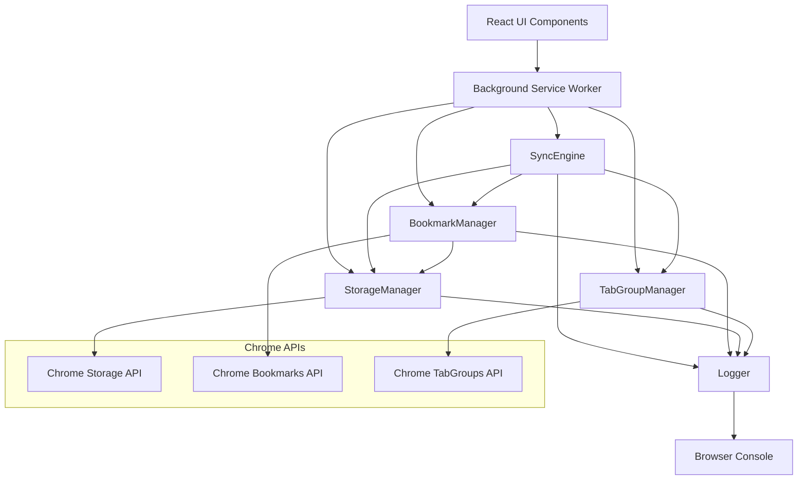

# Design Document

## Overview

Tab Group Sync is a Chrome extension that provides reliable synchronization between Chrome tab groups and bookmark folders. The system maintains persistent state across browser sessions while handling various failure scenarios gracefully. The architecture separates concerns between UI components, business logic managers, and Chrome API interactions to ensure testability and maintainability.

## Architecture

### High-Level Architecture



### Component Responsibilities

- **UI Components**: User interface for sync control and status display
- **Background Service Worker**: Event handling and coordination
- **SyncEngine**: Core synchronization logic and state management
- **StorageManager**: Persistent state and settings management
- **BookmarkManager**: Bookmark folder operations and structure maintenance
- **TabGroupManager**: Tab group lifecycle and event handling
- **Logger**: Centralized logging for operations, errors, state changes, and automatic decisions

### Chrome API Architecture

**Promise-Based Design**: All Chrome API interactions use promise-based syntax with async/await for consistency and maintainability.

Chrome Manifest V3 provides native promise support for most APIs. The extension uses this directly without callback wrappers:

```typescript
// ✅ Correct: Promise-based with async/await
async function getTabGroup(groupId: number): Promise<chrome.tabGroups.TabGroup> {
  return await chrome.tabGroups.get(groupId);
}

// ✅ Correct: Promise-based query
async function getTabs(groupId: number): Promise<chrome.tabs.Tab[]> {
  return await chrome.tabs.query({ groupId });
}

// ❌ Incorrect: Callback-based (avoid)
function getTabGroupCallback(groupId: number, callback: (group: chrome.tabGroups.TabGroup) => void) {
  chrome.tabGroups.get(groupId, callback);
}
```

**Benefits:**
- Cleaner, more readable code with async/await
- Better error handling with try/catch
- Easier testing with promise-based mocks
- Consistent with modern JavaScript practices
- Better TypeScript type inference

## Components and Interfaces

### SyncEngine Interface

```typescript
interface SyncEngine {
  // Core sync operations
  syncAll(): Promise<void>
  syncGroupToFolder(name: string): Promise<void>
  
  // Group sync control
  setGroupSyncEnabled(name: string, enabled: boolean): Promise<void>
  getGroupSyncEnabled(name: string): Promise<boolean>
  toggleSync(name: string): Promise<void>
  
  // Event handlers
  handleGroupCreated(group: chrome.tabGroups.TabGroup): Promise<void>
  handleGroupUpdated(group: chrome.tabGroups.TabGroup): Promise<void>
  handleGroupRemoved(name: string): Promise<void>
  
  // Folder management
  ensureSyncFolders(name: string): Promise<BookmarkFolderId>
}
```

### StorageManager Interface

```typescript
interface StorageManager {
  // Settings operations
  getSettings(): Promise<GlobalSettings>
  updateSettings(settings: Partial<GlobalSettings>): Promise<void>
  
  // Group sync preferences (persisted)
  getGroupSyncSettings(name: string): Promise<GroupSyncSettings>
  updateGroupSyncSettings(name: string, settings: GroupSyncSettings): Promise<void>
  
  // Runtime mappings (in-memory)
  getMapping(name: string): Promise<RuntimeMapping | undefined>
  updateMapping(name: string, update: RuntimeMappingUpdate): Promise<void>
  getAllMappings(): Promise<Record<string, RuntimeMapping>>
  
  // History and state
  addHistoryEntry(entry: SyncHistoryEntry): Promise<void>
  getHistory(): Promise<SyncHistoryEntry[]>
  getState(): Promise<CombinedState>
}
```

### BookmarkManager Interface

```typescript
interface BookmarkManager {
  // Container folder management
  getContainerFolder(): Promise<chrome.bookmarks.BookmarkTreeNode | null>
  createContainerFolder(): Promise<chrome.bookmarks.BookmarkTreeNode>
  setupTabGroupsFolder(folder: chrome.bookmarks.BookmarkTreeNode): Promise<chrome.bookmarks.BookmarkTreeNode>
  ensureContainerFolderExists(): Promise<chrome.bookmarks.BookmarkTreeNode>
  
  // Group folder operations
  ensureGroupFolder(name: string): Promise<chrome.bookmarks.BookmarkTreeNode>
  syncGroupToFolder(name: string, tabs: chrome.tabs.Tab[], folderId: string): Promise<void>
  
  // Event handlers
  handleBookmarkRemoved(id: string, removeInfo: chrome.bookmarks.BookmarkRemoveInfo): Promise<void>
}
```

#### Container Folder Management Details

The BookmarkManager implements automatic folder structure recovery:

1. **Detection**: When `handleBookmarkRemoved` detects container folder deletion, it checks if any tab groups still exist
2. **Automatic Recreation**: If tab groups exist, the manager recreates the container folder using `removeInfo.parentId` and `removeInfo.node.title` from the deletion event (since the folder itself is already gone and cannot be queried)
3. **Logging**: All folder recreation decisions are logged with reasoning
4. **Structure Validation**: The `ensureContainerFolderExists` method validates and repairs folder structure on-demand

```typescript
async handleBookmarkRemoved(id: string, removeInfo: chrome.bookmarks.BookmarkRemoveInfo): Promise<void> {
  const settings = await storageManager.getSettings();
  
  // Check if the deleted folder was our container
  if (id === settings.containerFolderId) {
    const tabGroups = await chrome.tabGroups.query({});
    
    if (tabGroups.length > 0) {
      // Automatic recreation — use removeInfo since the folder is already deleted
      // IMPORTANT: Do NOT call getBookmark(settings.containerFolderId) here —
      // the folder no longer exists. Use removeInfo.parentId for the parent
      // and removeInfo.node.title for the folder name.
      logger.logDecision(
        'Recreating container folder',
        'Container folder was deleted but tab groups still exist',
        { deletedFolderId: id, existingGroupCount: tabGroups.length }
      );
      
      const parentId = removeInfo.parentId;
      const title = removeInfo.node.title || 'Tab Groups';
      const newContainer = await createBookmark(parentId, title);
      await storageManager.updateSettings({ containerFolderId: newContainer.id });
      await this.setupTabGroupsFolder(newContainer);
    }
  }
}
```

### Logger Interface

```typescript
interface Logger {
  // Operation logging
  logOperation(type: string, details: OperationDetails): void
  
  // Error logging
  error(context: string, error: Error | unknown, additionalContext?: Record<string, any>): void
  
  // State change logging
  logStateChange(component: string, before: any, after: any, reason: string): void
  
  // Automatic decision logging
  logDecision(decision: string, reasoning: string, context: Record<string, any>): void
  
  // General logging
  info(message: string, context?: Record<string, any>): void
  warn(message: string, context?: Record<string, any>): void
  debug(message: string, context?: Record<string, any>): void
}

interface OperationDetails {
  operation: 'sync' | 'create' | 'update' | 'delete' | 'restore'
  target: {
    type: 'group' | 'folder' | 'bookmark' | 'snapshot'
    id?: string
    name?: string
  }
  outcome: 'success' | 'failure' | 'partial'
  duration?: number
  error?: string
  metadata?: Record<string, any>
}
```

## Data Models

### Storage State Model

```typescript
interface StorageState {
  version: string
  settings: GlobalSettings
  syncPreferences: GroupSyncPreferences
  syncHistory: SyncHistoryEntry[]
}

interface GlobalSettings {
  containerFolderId?: string
  autoSync: boolean
  cleanup: {
    enabled: boolean
    inactiveThreshold: number // days
  }
}

interface GroupSyncPreferences {
  [groupName: string]: {
    syncEnabled: boolean
    userSet: boolean
    lastSeen: number
    lastSynced: number
  }
}
```

### Runtime State Model

```typescript
interface RuntimeState {
  mappings: Record<string, RuntimeMapping>
  groupSettings: Record<string, GroupSyncSettings>
}

interface RuntimeMapping {
  name: string
  currentGroupId?: string
  folderId: string
  color?: chrome.tabGroups.ColorEnum
  syncEnabled: boolean
  status: {
    lastSynced: number
    inProgress: boolean
    error?: string
  }
}
```

### Sync History Model

```typescript
interface SyncHistoryEntry {
  timestamp: number
  type: 'group-to-folder' | 'folder-to-group' | 'snapshot'
  groupId: string
  folderId?: string
  success: boolean
  error?: string
  details?: string
}
```

## Chrome Event Flow

### Overview

Chrome fires tab group events that the extension must handle correctly. The key insight
is that **newly created groups start with an empty title** (`""`). The user may or may
not name the group afterwards. The extension must not sync a group until it has a
meaningful name.

### Event → Component Flow

```
Chrome Event                    Listener                          SyncEngine
────────────────────────────────────────────────────────────────────────────────
tabGroups.onCreated ──────────► tabGroupListeners.ts             handleGroupCreated()
  group.title = ""               enqueue in groupQueue              resolveGroupName("") → null
  (transient state)              processGroupQueue()                → SKIP (group unnamed)

tabGroups.onUpdated ──────────► tabGroupListeners.ts             handleGroupUpdated()
  group.title = "Work"           direct call                        resolveGroupName("Work") → "Work"
  (user named the group)                                            → create mapping + queueSync

tabGroups.onUpdated ──────────► tabGroupListeners.ts             handleGroupUpdated()
  color/collapse change          direct call                        update mapping color/state
  (title unchanged)

tabGroups.onRemoved ──────────► tabGroupListeners.ts             handleGroupRemoved()
  group deleted or               enqueue in removalQueue            preserve bookmarks (Req 1.5)
  window closed
```

### Key Design Decision

When `onCreated` fires, `group.title` is always `""`. This is Chrome's default — the
user has not typed a name yet. Syncing at this point would:

1. Create a bookmark folder for a group that may be renamed moments later
2. Cause data loss if multiple unnamed groups overwrite each other's bookmarks
3. Waste Chrome storage API quota on transient state

Therefore: **unnamed groups are observed but not synced**. Sync begins only when
`onUpdated` delivers a non-empty, non-whitespace title.

## Group Name Handling

### Overview

The extension uses group names (titles) as primary identifiers for storage keys, mappings, and bookmark folders. This design choice enables cross-device sync since group IDs are local to each browser instance.

### Name Resolution Strategy

```typescript
/**
 * Resolves a tab group title to a usable group name
 * 
 * Rules:
 * 1. undefined/null/empty → null (group is unnamed/transient — do NOT sync)
 * 2. Whitespace-only → null (skip this group)
 * 3. Valid name → use as-is
 */
function resolveGroupName(title: string | undefined): string | null {
  // Handle undefined, null, or empty — group is unnamed/transient
  if (title === undefined || title === null || title === '') {
    return null;
  }
  
  // Check if whitespace-only
  if (title.trim().length === 0) {
    return null; // Signal to skip this group
  }
  
  // Use title as-is (no trimming to preserve user intent)
  return title;
}
```

### Behavior Specifications

**Unnamed Groups (empty/undefined/null title):**
- These groups are NOT synced — they are in a transient state
- The most common cause is `tabGroups.onCreated` firing before the user types a name
- Multiple unnamed groups with different IDs are separate groups and must not be merged
- When the user names the group (via `onUpdated`), sync begins under the new name

**Whitespace-Only Groups:**
- Groups with whitespace-only titles (e.g., " ", "  ") are NOT managed
- These groups are skipped during sync operations
- No bookmark folders are created for them
- Auto-sync does not enable for these groups

**Valid Named Groups:**
- Group names are used as-is without modification
- Leading/trailing whitespace is preserved (user intent)
- Each unique name gets its own bookmark folder

### Implementation Points

**SyncEngine:**
```typescript
async handleGroupCreated(group: chrome.tabGroups.TabGroup): Promise<void> {
  const name = resolveGroupName(group.title);
  
  // Skip unnamed or whitespace-only groups
  if (name === null) {
    this.logger.info('sync:groupSkipped', {
      reason: 'unnamed or whitespace-only title',
      groupId: group.id
    });
    return;
  }
  
  // Continue with sync logic using resolved name
  // ...
}
```

**BookmarkManager:**
```typescript
async ensureGroupFolder(title: string | undefined): Promise<chrome.bookmarks.BookmarkTreeNode | null> {
  const name = resolveGroupName(title);
  
  // Return null for unnamed or whitespace-only groups
  if (name === null) {
    return null;
  }
  
  // Continue with folder creation using resolved name
  // ...
}
```

**StorageManager:**
```typescript
async getGroupSyncSettings(title: string | undefined): Promise<GroupSyncSettings> {
  const name = resolveGroupName(title);
  
  // Return disabled settings for unnamed or whitespace-only groups
  if (name === null) {
    return { enabled: false, lastSynced: 0 };
  }
  
  // Continue with settings lookup using resolved name
  // ...
}
```

### Edge Cases

**Unnamed Groups:**
- NOT synced — treated as transient
- Each unnamed group is independent (different group IDs)
- Sync begins only when the user provides a valid name

**Whitespace Variations:**
- " " (single space) → skipped
- "  " (multiple spaces) → skipped
- "\t" (tab) → skipped
- "\n" (newline) → skipped
- Any combination of whitespace → skipped

**Name Conflicts:**
- Two groups with identical names share the same bookmark folder
- This is a known limitation due to using names as identifiers
- Users should ensure unique names for important groups

### Logging

All name resolution decisions are logged:

```typescript
// Unnamed group (transient — not synced)
logger.info('groupName:skipped', {
  original: undefined,
  resolved: null,
  reason: 'unnamed group — transient state, not synced'
});

// Whitespace-only group
logger.info('groupName:skipped', {
  original: '   ',
  resolved: null,
  reason: 'whitespace-only title'
});

// Valid name
logger.debug('groupName:resolved', {
  original: 'Work Tabs',
  resolved: 'Work Tabs',
  reason: 'valid title'
});
```

### Testing Considerations

**Property-Based Tests:**
- Test with undefined titles → verify group is skipped (null)
- Test with whitespace-only titles → verify group is skipped (null)
- Test with valid names → verify name returned as-is
- Verify unnamed groups are NOT synced
- Verify whitespace groups are skipped

**Unit Tests:**
- Test `resolveGroupName()` with all edge cases
- Verify null return for undefined/null/empty
- Verify null return for whitespace-only
- Verify valid names returned as-is

**E2E Tests:**
- Create unnamed groups and verify NO sync occurs
- Name a group and verify sync begins
- Create whitespace-only groups and verify no sync
- Verify logging for all scenarios

## Correctness Properties

*A property is a characteristic or behavior that should hold true across all valid executions of a system—essentially, a formal statement about what the system should do. Properties serve as the bridge between human-readable specifications and machine-verifiable correctness guarantees.*

### Core Sync Properties

**Property 1: Tab Group to Bookmark Folder Synchronization**
*For any* tab group with sync enabled, when tabs are added to the group, the corresponding bookmark folder should contain bookmarks for all those tabs
**Validates: Requirements 1.1, 1.2**

**Property 2: Bookmark Preservation During Tab Operations**
*For any* synced tab group, when tabs are removed from the group, the existing bookmarks in the corresponding folder should remain unchanged (no automatic deletion)
**Validates: Requirements 1.3**

**Property 3: Title Change Creates New Folder**
*For any* synced tab group, when the group title changes, the Sync_Engine should start syncing to a new bookmark folder under the new name, preserving the old folder and its contents as-is
**Validates: Requirements 1.4**

**Property 4: Group Deletion Preservation**
*For any* synced tab group, when the group is deleted, the corresponding bookmark folder and all its contents should remain intact
**Validates: Requirements 1.5**

### State Management Properties

**Property 5: Sync Preference Persistence**
*For any* tab group, when sync is toggled on or off, the preference should persist across browser restarts and be restored correctly
**Validates: Requirements 3.1, 7.1**

**Property 6: Runtime and Persisted State Consistency**
*For any* storage operation, the runtime mappings should remain consistent with persisted preferences, with persisted state serving as the source of truth for conflicts
**Validates: Requirements 9.1, 9.2, 9.3**

**Property 7: State Recovery from Corruption**
*For any* corrupted or invalid state data, the Storage_Manager should reset to safe defaults while preserving user bookmarks and logging appropriate errors
**Validates: Requirements 7.2, 9.4**

### Sync Control Properties

**Property 8: Sync State Transitions**
*For any* tab group, when sync is disabled, the Sync_Engine should stop monitoring changes, and when re-enabled, should immediately synchronize the current state
**Validates: Requirements 3.2, 3.3, 3.4**

**Property 9: Auto-Sync Behavior**
*For any* new tab group created when auto-sync is enabled and a container folder is selected, sync should be automatically enabled and the preference should be persisted
**Validates: Requirements 6.1, 6.4**

**Property 10: Auto-Sync Preconditions**
*For any* new tab group, when auto-sync is disabled or no container folder is selected, sync should not be automatically enabled regardless of other settings
**Validates: Requirements 6.2, 6.3**

### Ungrouped Tab Handling Properties

**Property 11: Ungrouped Tab Exclusion**
*For any* tab that is not in a group (groupId === -1), the Extension should not create bookmarks or track the tab in any sync operations
**Validates: Requirements 13.1, 13.4**

**Property 12: Ungrouped Tab Bookmark Preservation**
*For any* tab that is removed from a group, the Extension should preserve the existing bookmark but should not continue tracking the now-ungrouped tab
**Validates: Requirements 13.2**

**Property 13: UI Display Filtering**
*For any* UI display of sync status, only tabs that belong to groups should be shown, with ungrouped tabs completely excluded from the interface
**Validates: Requirements 13.3**

### Folder Management Properties

**Property 14: Container Folder Structure Creation**
*For any* selected container folder, the Bookmark_Manager should create "Tab Group Bookmarks" and "Tab Group Snapshots" subfolders with proper hierarchy
**Validates: Requirements 4.1**

**Property 15: Automatic Folder Structure Recovery**
*For any* deleted or corrupted container folder structure, when tab groups still exist, the Bookmark_Manager should automatically detect the issue and recreate the required hierarchy
**Validates: Requirements 4.2, 4.3**

**Property 16: Nested Container Deduplication**
*For any* nested container folder structure, the Bookmark_Manager should use the parent container to avoid duplication
**Validates: Requirements 4.4**

### Snapshot System Properties

**Property 17: Snapshot Creation and Storage**
*For any* tab group snapshot creation, the current group state should be saved with a timestamp in the "Tab Group Snapshots" folder
**Validates: Requirements 5.1, 5.3**

**Property 18: Snapshot Restoration Round-Trip**
*For any* saved snapshot, restoring it should recreate a tab group with the same tabs that were present when the snapshot was created
**Validates: Requirements 5.2**

**Property 19: Snapshot Cleanup Policy**
*For any* snapshot collection that exceeds limits, the oldest snapshots should be removed first to maintain the limit
**Validates: Requirements 5.4**

### Snapshot Restore Design (Requirement 5.2)

**Flow**: User clicks "Restore" button on a snapshot in the SnapshotList dialog → popup sends `RESTORE_SNAPSHOT` message to background → `SnapshotManager.restoreSnapshot(snapshotId)` reads the snapshot's bookmarks → creates a new tab group with `chrome.tabs.create` + `chrome.tabs.group` + `chrome.tabGroups.update` → sync engine picks up the new group via `onCreated`/`onUpdated` events.

**SnapshotManager.restoreSnapshot pseudocode:**
```
async restoreSnapshot(snapshotId):
  snapshot = getBookmark(snapshotId)
  if !snapshot: throw "Snapshot not found"

  // Parse metadata from folder title: "name|sourceId|datetime"
  metadata = parseSnapshotTitle(snapshot.title)

  // Read all bookmarks in the snapshot folder
  bookmarks = getBookmarkChildren(snapshotId)
  urls = bookmarks.filter(b => b.url).map(b => ({ url: b.url, title: b.title }))
  if urls.length === 0: throw "Snapshot has no tabs"

  // Create tabs for each bookmark
  tabs = []
  for each { url, title } in urls:
    tab = chrome.tabs.create({ url, active: false })
    tabs.push(tab)

  // Group the tabs into a new tab group
  groupId = chrome.tabs.group({ tabIds: tabs.map(t => t.id) })

  // Set the group title and color from metadata
  chrome.tabGroups.update(groupId, { title: metadata.sourceName, color: 'blue' })

  return { groupId, tabCount: urls.length, groupName: metadata.sourceName }
```

**UI**: Add a "Restore" icon button (e.g., `RestoreIcon` from MUI) next to each snapshot's delete button in `SnapshotList.tsx`. On click, send `RESTORE_SNAPSHOT` message and show success/error feedback.

**Background message handler**: Add `RESTORE_SNAPSHOT` case in the message listener that calls `snapshotManager.restoreSnapshot(snapshotId)` and returns the result.

### Error Handling and Recovery Properties

**Property 20: Sync Operation Error Handling**
*For any* failed sync operation, the system should display specific error messages, retry with appropriate delays, and maintain system stability
**Validates: Requirements 8.1, 8.3**

**Property 21: Permission and Quota Management**
*For any* insufficient permissions or quota limits, the system should request appropriate permissions or inform users with suggested cleanup actions
**Validates: Requirements 8.2, 8.4**

**Property 22: Storage Operation Resilience**
*For any* storage operation failure or quota exceeded condition, the Storage_Manager should implement retry strategies and cleanup to maintain functionality
**Validates: Requirements 7.3, 7.4**

### Performance and Resource Management Properties

**Property 23: Sync Operation Queuing**
*For any* multiple concurrent sync requests, the Sync_Engine should queue operations to prevent Chrome API rate limiting and process them sequentially
**Validates: Requirements 10.1**

**Property 24: Change Debouncing**
*For any* rapid sequence of tab changes, the Sync_Engine should debounce sync operations to reduce overhead while ensuring eventual consistency
**Validates: Requirements 10.2**

**Property 25: Batch Processing for Large Operations**
*For any* large number of tabs being synced, the Sync_Engine should process them in batches to avoid blocking the browser
**Validates: Requirements 10.3**

**Property 26: Memory Management**
*For any* growing memory usage, the Extension should implement cleanup strategies for cached data to maintain performance
**Validates: Requirements 10.4**

### Logging and Observability Properties

**Property 27: Operation Logging Completeness**
*For any* sync operation (create, update, delete, restore), the Logger should record the operation type, target group/folder, outcome, and relevant metadata to the console
**Validates: Requirements 11.1**

**Property 28: Error Logging with Context**
*For any* error that occurs, the Logger should record detailed error information including the error message, stack trace, and contextual information about what operation was being performed
**Validates: Requirements 11.2**

**Property 29: State Change Logging**
*For any* state change in the system, the Logger should record both the before and after states along with the reason for the change
**Validates: Requirements 11.3**

**Property 30: Automatic Decision Logging**
*For any* automatic decision made by the system (auto-sync enabling, folder recreation, cleanup actions), the Logger should record the decision and the reasoning behind it
**Validates: Requirements 11.4**

## Error Handling

### Error Categories

1. **Storage Errors**: Chrome storage quota exceeded, storage corruption, permission issues
2. **Bookmark Errors**: Folder deletion, permission denied, bookmark creation failures
3. **Sync Errors**: Network failures, rate limiting, state conflicts
4. **Validation Errors**: Invalid data formats, missing required fields, type mismatches

### Error Recovery Strategies

1. **Exponential Backoff**: For transient failures like network errors or rate limiting
2. **Graceful Degradation**: Continue core functionality when non-critical features fail
3. **State Reset**: Reset to safe defaults when corruption is detected
4. **User Notification**: Clear error messages with actionable suggestions

### Error Handling Patterns

```typescript
// Retry with exponential backoff
async function withRetry<T>(
  operation: () => Promise<T>,
  maxAttempts: number = 3,
  baseDelay: number = 1000
): Promise<T> {
  for (let attempt = 1; attempt <= maxAttempts; attempt++) {
    try {
      return await operation();
    } catch (error) {
      if (attempt === maxAttempts) throw error;
      await delay(baseDelay * Math.pow(2, attempt - 1));
    }
  }
  throw new Error('Max attempts exceeded');
}

// Error boundary for UI components
class SyncErrorBoundary extends React.Component {
  componentDidCatch(error: Error, errorInfo: React.ErrorInfo) {
    Logger.getInstance().error('ui:error', { error, errorInfo });
    // Show fallback UI
  }
}
```

## Logging and Observability

### Observability Architecture

The extension uses a dual-approach observability strategy combining Chrome DevTools Console for operational logs and Chrome DevTools Performance Tab for performance analysis:

**Chrome DevTools Console:**
- Operational logs (operations, errors, state changes, decisions)
- Structured logging with searchable/filterable output
- Error tracking with full stack traces

**Chrome DevTools Performance Tab:**
- Performance timing and bottleneck analysis
- Visual timeline of operations
- User Timing API for precise measurements

### Logger Implementation

The Logger is implemented as a singleton with structured logging and performance tracking:

```typescript
class Logger {
  private static instance: Logger;
  
  static getInstance(): Logger {
    if (!Logger.instance) {
      Logger.instance = new Logger();
    }
    return Logger.instance;
  }
  
  logOperation(type: string, details: OperationDetails): void {
    const timestamp = new Date().toISOString();
    const operationId = `${type}-${Date.now()}`;
    
    // Console logging for operational visibility
    console.log(`[${timestamp}] [OPERATION] ${type}`, {
      target: details.target,
      outcome: details.outcome,
      duration: details.duration,
      metadata: details.metadata
    });
    
    // Performance API for timing analysis
    if (details.duration) {
      performance.mark(`${operationId}-start`);
      performance.mark(`${operationId}-end`);
      performance.measure(
        `operation:${type}`,
        `${operationId}-start`,
        `${operationId}-end`
      );
    }
  }
  
  error(context: string, error: Error | unknown, additionalContext?: Record<string, any>): void {
    const timestamp = new Date().toISOString();
    
    // Console error logging with full context
    console.error(`[${timestamp}] [ERROR] ${context}`, {
      error: error instanceof Error ? {
        message: error.message,
        stack: error.stack,
        name: error.name
      } : error,
      context: additionalContext
    });
  }
  
  logStateChange(component: string, before: any, after: any, reason: string): void {
    const timestamp = new Date().toISOString();
    console.log(`[${timestamp}] [STATE_CHANGE] ${component}`, {
      before,
      after,
      reason
    });
  }
  
  logDecision(decision: string, reasoning: string, context: Record<string, any>): void {
    const timestamp = new Date().toISOString();
    console.log(`[${timestamp}] [DECISION] ${decision}`, {
      reasoning,
      context
    });
  }
  
  // Performance timing helpers
  startTiming(operationName: string): string {
    const markName = `${operationName}-${Date.now()}`;
    performance.mark(`${markName}-start`);
    return markName;
  }
  
  endTiming(markName: string, operationName: string): void {
    performance.mark(`${markName}-end`);
    performance.measure(
      operationName,
      `${markName}-start`,
      `${markName}-end`
    );
  }
}
```

### Performance Tracking Integration

Wrap performance-critical operations with timing marks:

```typescript
// Example: Sync operation with performance tracking
async syncGroupToFolder(groupName: string): Promise<void> {
  const timingMark = logger.startTiming('sync-group-to-folder');
  const startTime = Date.now();
  
  try {
    // Perform sync operation
    await this.performSync(groupName);
    
    const duration = Date.now() - startTime;
    logger.endTiming(timingMark, 'sync-group-to-folder');
    
    logger.logOperation('sync-group-to-folder', {
      target: { groupName },
      outcome: 'success',
      duration,
      metadata: { /* ... */ }
    });
  } catch (error) {
    logger.error('sync-group-to-folder', error, { groupName });
    throw error;
  }
}
```

### Logging Integration Points

1. **Sync Operations**: Log every sync operation with target, outcome, and duration
2. **Error Handling**: Log all errors with full context and stack traces
3. **State Changes**: Log storage updates, mapping changes, and preference modifications
4. **Automatic Decisions**: Log auto-sync enablement, folder recreation, and cleanup actions
5. **Performance Metrics**: Track operation durations using Performance API

### Logging Examples

```typescript
// Operation logging with performance tracking
const timingMark = logger.startTiming('sync');
await syncEngine.syncGroupToFolder(groupName);
logger.endTiming(timingMark, 'sync');

logger.logOperation('sync', {
  target: { type: 'group', name: 'Work Tabs', id: '123' },
  outcome: 'success',
  duration: 245,
  metadata: { tabCount: 12, bookmarkCount: 12 }
});

// Error logging
try {
  await syncEngine.syncGroupToFolder(groupName);
} catch (error) {
  logger.error('sync:group-to-folder', error, {
    groupName,
    folderId,
    attemptNumber: 3
  });
}

// State change logging
logger.logStateChange('StorageManager', 
  { syncEnabled: false },
  { syncEnabled: true },
  'User toggled sync for group "Work Tabs"'
);

// Automatic decision logging
logger.logDecision(
  'Auto-sync enabled for new group',
  'Auto-sync setting is enabled and container folder is configured',
  { groupName: 'New Project', autoSyncEnabled: true, containerFolderId: '456' }
);
```

### Using Chrome DevTools for Analysis

#### Console Tab - Operational Logs

**Filtering logs:**
- Filter by `[OPERATION]` to see all sync operations
- Filter by `[ERROR]` to see all errors
- Filter by `[STATE_CHANGE]` to track state modifications
- Filter by `[DECISION]` to understand automatic behaviors
- Use regex filters for specific operations: `/sync.*Work Tabs/`

**Searching within logs:**
- Chrome Console automatically indexes JSON objects
- Search for specific field values
- Click to expand nested objects
- Copy log objects for offline analysis

**Error analysis:**
- Errors automatically grouped by stack trace
- Click error to jump to source location
- Full context available in error object

#### Performance Tab - Timing Analysis

**Recording a session:**
1. Open Chrome DevTools → Performance tab
2. Click "Record" button
3. Perform operations (create groups, sync, etc.)
4. Click "Stop" to analyze

**Analyzing performance:**
- **User Timing section**: Shows all `performance.measure()` calls
- **Timeline view**: Visual representation of operations
- **Bottom-Up/Call Tree**: Identify bottlenecks
- **Flame chart**: See operation hierarchy and duration

**Finding bottlenecks:**
- Look for long operations in User Timing section
- Identify operations taking >100ms
- See which operations block others
- Compare sync times across different group sizes

**Example analysis workflow:**
1. Record session while syncing multiple groups
2. Check User Timing for "sync-group-to-folder" measures
3. Identify slowest sync operations
4. Cross-reference with Console logs for context
5. Optimize slow operations

### Log Filtering and Debugging

**Common debugging workflows:**

1. **Finding all errors:**
   - Filter Console by `[ERROR]`
   - Review error context and stack traces
   - Cross-reference with operation logs

2. **Tracking a specific group:**
   - Search Console for group name
   - See all operations, state changes, and decisions
   - Identify where issues occur

3. **Performance bottleneck analysis:**
   - Record Performance session
   - Check User Timing for slow operations
   - Filter Console logs for those operations
   - Identify root cause

4. **Understanding automatic decisions:**
   - Filter Console by `[DECISION]`
   - Review reasoning and context
   - Verify expected behavior

### Production Observability

For production deployments, consider adding optional integrations:
- **Sentry**: Error tracking and performance monitoring (free tier available)
- **LogRocket**: Session replay for debugging user issues
- **Chrome Extension Analytics**: Usage metrics and crash reporting

These are optional and not required for core functionality. The built-in Chrome DevTools approach provides comprehensive observability for development and debugging.

## Testing Strategy

### Three-Tier Testing Approach

The testing strategy employs unit tests, property-based tests, and end-to-end tests to ensure comprehensive coverage:

- **Unit Tests**: Verify specific examples, edge cases, and error conditions with mocked Chrome APIs
- **Property Tests**: Verify universal properties across all inputs using randomized testing
- **E2E Tests**: Verify real Chrome extension behavior in isolated browser environments using Playwright

### Testing Architecture

```
┌─────────────────────────────────────────────────────────────┐
│                     Test Pyramid                             │
├─────────────────────────────────────────────────────────────┤
│  E2E Tests (Playwright)                                      │
│  - Real Chrome extension loaded                              │
│  - Isolated browser profiles                                 │
│  - Full integration testing                                  │
├─────────────────────────────────────────────────────────────┤
│  Property-Based Tests (fast-check)                           │
│  - Randomized input generation                               │
│  - Correctness property validation                           │
│  - Mocked Chrome APIs                                        │
├─────────────────────────────────────────────────────────────┤
│  Unit Tests (Vitest/Jest)                                    │
│  - Manager class methods                                     │
│  - Utility functions                                         │
│  - Mocked Chrome APIs                                        │
└─────────────────────────────────────────────────────────────┘
```

### Unit Testing Configuration

**Framework**: Vitest or Jest
**Mocking**: Manual Chrome API mocks
**Coverage Target**: 80%+ code coverage

```typescript
// Mock Chrome APIs for unit testing
const mockChrome = {
  storage: {
    sync: {
      get: vi.fn(),
      set: vi.fn(),
      clear: vi.fn()
    }
  },
  bookmarks: {
    create: vi.fn(),
    get: vi.fn(),
    getChildren: vi.fn(),
    update: vi.fn(),
    remove: vi.fn()
  },
  tabGroups: {
    query: vi.fn(),
    get: vi.fn(),
    update: vi.fn()
  },
  tabs: {
    query: vi.fn(),
    get: vi.fn(),
    create: vi.fn()
  }
};
```

**Unit Testing Focus Areas:**
- Manager class methods (StorageManager, BookmarkManager, SyncEngine)
- Error conditions and recovery mechanisms
- Edge cases (empty groups, missing folders, quota limits)
- Utility functions and helpers

### Property-Based Testing Configuration

**Library**: fast-check
**Iterations**: Minimum 100 iterations per property test
**Test Tags**: Each property test references its design document property
**Tag Format**: `Feature: tab-group-sync, Property {number}: {property_text}`

```typescript
// Property test generators
const arbitraryTabGroup = fc.record({
  id: fc.integer({ min: 1, max: 1000 }),
  title: fc.string({ minLength: 1, maxLength: 50 }),
  color: fc.constantFrom('grey', 'blue', 'red', 'yellow', 'green', 'pink', 'purple', 'cyan', 'orange'),
  windowId: fc.integer({ min: 1, max: 10 }),
  collapsed: fc.boolean()
});

const arbitraryTab = fc.record({
  id: fc.integer({ min: 1, max: 10000 }),
  url: fc.webUrl(),
  title: fc.string({ minLength: 1, maxLength: 100 }),
  pinned: fc.boolean(),
  groupId: fc.integer({ min: -1, max: 1000 })
});

// Example property test
describe('Property 1: Tab Group to Bookmark Folder Synchronization', () => {
  it('should create bookmarks for all tabs added to synced group', async () => {
    await fc.assert(
      fc.asyncProperty(
        arbitraryTabGroup,
        fc.array(arbitraryTab, { minLength: 1, maxLength: 20 }),
        async (group, tabs) => {
          // Test implementation
        }
      ),
      { numRuns: 100 }
    );
  });
});
```

**Property Testing Focus Areas:**
- State consistency across operations
- Data preservation during sync operations
- Error recovery and graceful degradation
- Performance constraints

### End-to-End Testing with Playwright

**Framework**: Playwright
**Browser**: Chromium with extension support
**Isolation**: Each test runs in a fresh browser profile

#### E2E Testing Constraints (CRITICAL)

E2E tests must simulate real user behavior. The following rules are **non-negotiable**:

1. **NO direct storage manipulation**: Tests MUST NOT call `chrome.storage.sync.set/get/clear` to configure the extension. All settings (container folder, auto-sync, etc.) must be configured through the popup UI.
2. **NO `chrome.runtime.sendMessage`**: Tests MUST NOT send internal messages to the background service worker. All actions (toggle sync, create snapshot, restore snapshot) must be triggered through popup UI clicks.
3. **NO `setExtensionStorage()` / `clearExtensionStorage()` / `sendMessageToBackground()` helpers**: These utility functions bypass the UI and must be removed from E2E test utils.
4. **Browser-level actions are acceptable**: `chrome.tabs.create`, `chrome.tabs.group`, `chrome.tabGroups.update` are acceptable because these simulate browser-level user actions (creating tabs, grouping tabs) that have no extension UI equivalent.
5. **Read-only Chrome API assertions are acceptable**: `chrome.bookmarks.getChildren`, `chrome.bookmarks.search`, `chrome.tabGroups.query` are acceptable for verifying outcomes since bookmark state is the ground truth.
6. **UI-based helpers MUST be used**: The existing `toggleGroupSync()`, `setContainerFolder()`, `createSnapshot()` helpers in utils.ts interact with the popup UI and should be the primary way tests trigger extension actions.
7. **Setup flow**: Every test that needs the extension configured must follow the real user workflow:
   - Open popup → navigate to Settings → pick container folder → enable auto-sync
   - NOT: write directly to chrome.storage.sync

**Rationale**: E2E tests that bypass the UI provide false confidence. They test internal wiring, not user experience. Bugs in the UI layer, message passing, and state hydration are invisible to tests that skip the UI.

#### Playwright Configuration

```typescript
// playwright.config.ts
import { defineConfig, devices } from '@playwright/test';
import path from 'path';

export default defineConfig({
  testDir: './tests/e2e',
  fullyParallel: false, // Extensions need sequential execution
  forbidOnly: !!process.env.CI,
  retries: process.env.CI ? 2 : 0,
  workers: 1, // One worker to avoid profile conflicts
  reporter: 'html',
  use: {
    trace: 'on-first-retry',
  },
  projects: [
    {
      name: 'chromium-extension',
      use: { 
        ...devices['Desktop Chrome'],
        // Extension will be loaded per test
      },
    },
  ],
});
```

#### Extension Loading in Tests

```typescript
// tests/e2e/fixtures/extension.ts
import { test as base, chromium, BrowserContext } from '@playwright/test';
import path from 'path';

export const test = base.extend<{
  context: BrowserContext;
  extensionId: string;
}>({
  context: async ({}, use) => {
    const pathToExtension = path.join(__dirname, '../../../dist');
    const context = await chromium.launchPersistentContext('', {
      headless: false,
      args: [
        `--disable-extensions-except=${pathToExtension}`,
        `--load-extension=${pathToExtension}`,
      ],
    });
    await use(context);
    await context.close();
  },
  extensionId: async ({ context }, use) => {
    let [background] = context.serviceWorkers();
    if (!background)
      background = await context.waitForEvent('serviceworker');

    const extensionId = background.url().split('/')[2];
    await use(extensionId);
  },
});

export { expect } from '@playwright/test';
```

#### E2E Test Examples

```typescript
// tests/e2e/sync.spec.ts
import { test, expect } from './fixtures/extension';

test.describe('Tab Group Sync E2E', () => {
  test('should sync tab group to bookmarks', async ({ page, context, extensionId }) => {
    // Create a tab group
    await page.goto('https://example.com');
    const tabId = await page.evaluate(() => chrome.tabs.getCurrent().then(t => t.id));
    
    await page.evaluate(async (tabId) => {
      const groupId = await chrome.tabs.group({ tabIds: [tabId] });
      await chrome.tabGroups.update(groupId, { 
        title: 'Test Group',
        color: 'blue'
      });
    }, tabId);

    // Open extension popup
    const popupPage = await context.newPage();
    await popupPage.goto(`chrome-extension://${extensionId}/popup.html`);

    // Verify group appears in UI
    await expect(popupPage.locator('text=Test Group')).toBeVisible();

    // Enable sync
    await popupPage.locator('[data-testid="sync-toggle-Test Group"]').click();

    // Verify bookmark was created
    const bookmarks = await page.evaluate(async () => {
      const tree = await chrome.bookmarks.getTree();
      return JSON.stringify(tree);
    });
    
    expect(bookmarks).toContain('Test Group');
  });

  test('should recreate container folder when deleted', async ({ page, context, extensionId }) => {
    // Setup: Create synced group with container folder
    // ... setup code ...

    // Delete container folder
    await page.evaluate(async (folderId) => {
      await chrome.bookmarks.removeTree(folderId);
    }, containerFolderId);

    // Trigger sync operation
    await page.evaluate(async () => {
      await chrome.runtime.sendMessage({ type: 'SYNC_ALL' });
    });

    // Wait for folder recreation
    await page.waitForTimeout(1000);

    // Verify folder was recreated
    const folderExists = await page.evaluate(async () => {
      const tree = await chrome.bookmarks.getTree();
      // Check for "Tab Group Bookmarks" folder
      return JSON.stringify(tree).includes('Tab Group Bookmarks');
    });

    expect(folderExists).toBe(true);
  });

  test('should sync across multiple browser contexts', async ({ context, extensionId }) => {
    // Simulate cross-device sync by using multiple contexts
    const context2 = await chromium.launchPersistentContext('profile2', {
      headless: false,
      args: [
        `--disable-extensions-except=${pathToExtension}`,
        `--load-extension=${pathToExtension}`,
      ],
    });

    // Create group in first context
    const page1 = await context.newPage();
    // ... create and sync group ...

    // Verify sync in second context
    const page2 = await context2.newPage();
    // ... verify group appears ...

    await context2.close();
  });
});
```

#### E2E Testing Focus Areas

1. **Tab Group Operations**: Create, update, delete tab groups and verify sync
2. **Bookmark Synchronization**: Verify bookmarks are created/updated correctly
3. **UI Interactions**: Test popup UI, settings, and user workflows
4. **Container Folder Management**: Test folder creation, deletion, and recreation
5. **Snapshot System**: Test snapshot creation and restoration
6. **Cross-Device Sync**: Simulate multiple browser contexts
7. **Error Scenarios**: Test permission errors, quota limits, network failures
8. **Performance**: Test with large numbers of tabs and groups

### Test Organization

```
tests/
├── setup.ts                        # Shared Chrome API mocks
├── unit/                           # Unit tests (Vitest)
│   ├── bookmarks/
│   │   └── bookmarkManager.test.ts
│   ├── storage/
│   │   └── storageManager.test.ts
│   └── utils/
│       └── *.test.ts               # Utility function tests
├── property/                       # Property-based tests (fast-check)
│   ├── arbitraries.ts              # Shared generators
│   ├── testUtils.ts                # Shared test utilities
│   ├── PROPERTY_COVERAGE.md        # Coverage tracking
│   ├── bookmarks/                  # Bookmark property tests
│   ├── errors/                     # Error handling property tests
│   ├── logging/                    # Logging property tests
│   ├── performance/                # Performance property tests
│   ├── snapshots/                  # Snapshot property tests
│   ├── storage/                    # Storage property tests
│   ├── sync/                       # Sync property tests
│   └── ui/                         # UI property tests
├── e2e/                            # End-to-end tests (Playwright)
│   ├── fixtures.ts                 # Extension loading fixture
│   ├── utils.ts                    # E2E test helpers (UI-based only)
│   ├── smoke.test.ts               # Infrastructure smoke tests
│   ├── tab-group-sync.test.ts      # Core sync functionality
│   ├── container-folder.test.ts    # Container folder management
│   ├── snapshot-system.test.ts     # Snapshot system
│   ├── sync-control.test.ts        # Sync toggle and auto-sync
│   ├── cross-device-sync.test.ts   # Multi-context sync
│   ├── error-scenarios.test.ts     # Error scenarios
│   ├── ungrouped-tabs.test.ts      # Ungrouped tab handling
│   └── ui-interactions.test.ts     # UI interactions
```

### Test Execution

```bash
# Run all tests
npm test

# Run unit tests only
npm run test:unit

# Run property-based tests only
npm run test:property

# Run E2E tests only
npm run test:e2e

# Run tests with coverage
npm run test:coverage

# Run E2E tests in headed mode (see browser)
npm run test:e2e:headed

# Run specific E2E test
npx playwright test sync.spec.ts
```

### Continuous Integration

Tests should run in CI/CD pipeline:
1. **Unit tests**: Run on every commit (fast feedback)
2. **Property tests**: Run on every commit (moderate duration)
3. **E2E tests**: Run on pull requests and before deployment (slower)

### Coverage Requirements

- **Code Coverage**: Minimum 80% line coverage
- **Property Coverage**: All 30 correctness properties must have corresponding tests
- **E2E Coverage**: All user-facing features must have E2E tests